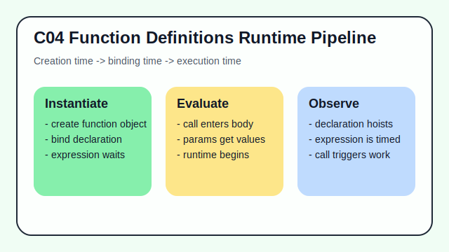

# C04 - Function Definitions Runtime Pipeline

## Tujuan

Bab ini bertujuan memahami pipeline evaluasi function declaration dan expression.

## Kenapa Bab Ini Penting

Banyak miskonsepsi function berasal dari salah paham urutan proses: parsing, instantiation, lalu evaluation. Memahami pipeline ini membuat perilaku hoisting dan scope jadi masuk akal.

## Konsep Inti

1. Function declaration diinstansiasi saat fase setup lexical environment.
2. Function expression dievaluasi saat baris ekspresinya dijalankan.
3. Perbedaan waktu instansiasi memengaruhi kapan function bisa dipanggil.

## Analogi Singkat

Bayangkan ada dua jenis stan di acara pameran: stan permanen yang sudah siap sejak pintu dibuka, dan stan lipat yang baru aktif setelah panitianya datang dan memasangnya. Keduanya bisa dipakai pengunjung, tetapi waktu siapnya berbeda. Dalam JavaScript, declaration mirip stan permanen, sedangkan expression mirip stan yang baru tersedia saat proses evaluasi sampai ke sana.

Contoh singkat:

```js
sayHi(); // valid untuk function declaration

function sayHi() {
  console.log('hi');
}

// sayBye(); // ReferenceError jika dipanggil sebelum inisialisasi
const sayBye = function () {
  console.log('bye');
};
```

## Praktik yang Direkomendasikan

- Gunakan declaration untuk util yang memang dipakai luas dalam satu scope.
- Gunakan expression saat ingin kontrol urutan inisialisasi yang eksplisit.
- Baca error runtime dengan mempertimbangkan fase instansiasi/evaluasi.

## Kesalahan Umum

- Mengira semua function dapat dipanggil sebelum ditulis.
- Menyamakan hoisting declaration dengan perilaku `const` function expression.
- Menulis alur inisialisasi yang membuat urutan eksekusi sulit ditelusuri.

## Checkpoint Cepat

1. Apa beda waktu ketersediaan declaration vs expression?
2. Kenapa `const fn = function(){}` tidak bisa dipanggil sebelum assignment?
3. Bagaimana pipeline ini membantu membaca error `ReferenceError`?

## Ringkasan

- Runtime pipeline function dipengaruhi oleh jenis definisinya.
- Declaration tersedia lebih awal karena instansiasi di fase setup.
- Expression aktif setelah ekspresi assignment dievaluasi.

## Spec Coverage

Bab ini terutama selaras dengan section ECMAScript berikut:

- `15.2.3`
- `15.2.4`
- `15.2.5`
- `15.2.6`

Referensi mapping penuh: `../docs/spec-mapping-70.md`.

## Visual Map



## Contoh Runnable

- Lihat contoh: `../examples/C04-function-definitions-runtime-pipeline/example.js`
- Lihat contoh tambahan: `../examples/C04-function-definitions-runtime-pipeline/example-02.js`
- Lihat contoh tambahan: `../examples/C04-function-definitions-runtime-pipeline/example-03.js`
- Panduan: `../examples/C04-function-definitions-runtime-pipeline/README.md`
