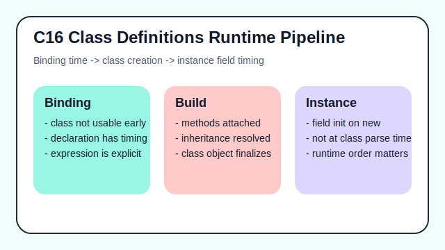

# C16 - Class Definitions Runtime Pipeline

## Tujuan

Bab ini bertujuan memahami pipeline evaluasi class declaration dan expression.

## Kenapa Bab Ini Penting

Bagian ini melanjutkan fondasi B04 agar pembaca memahami transisi dari aturan sintaks ke perilaku runtime.

## Konsep Inti

1. Konsep utama pertama (akan diisi pada tahap penulisan materi).
2. Konsep utama kedua (akan diisi pada tahap penulisan materi).
3. Konsep utama ketiga (akan diisi pada tahap penulisan materi).

## Praktik yang Direkomendasikan

- Uji tiap aturan dengan contoh runnable kecil.
- Pisahkan eksperimen compile-time dan runtime agar hasil observasi akurat.

## Kesalahan Umum

- Menganggap semua aturan statis terlihat langsung saat eksekusi.
- Mengabaikan urutan evaluasi saat membaca contoh kode.

## Checkpoint Cepat

1. Apa aturan utama pada bab ini?
2. Apa perilaku runtime yang paling penting dipahami?
3. Contoh mana yang paling membantu memvalidasi konsep bab ini?

## Ringkasan

- Ringkasan final bab akan diisi setelah materi lengkap.

## Spec Coverage

Bab ini terutama selaras dengan section ECMAScript berikut:

- `15.7.12`
- `15.7.13`
- `15.7.14`
- `15.7.15`
- `15.7.16`

Referensi mapping penuh: `../docs/spec-mapping-70.md`.

## Visual Map

## Contoh Runnable

- Lihat contoh: `../examples/C16-class-definitions-runtime-pipeline/example.js`
- Lihat contoh tambahan: `../examples/C16-class-definitions-runtime-pipeline/example-02.js`
- Lihat contoh tambahan: `../examples/C16-class-definitions-runtime-pipeline/example-03.js`
- Panduan: `../examples/C16-class-definitions-runtime-pipeline/README.md`