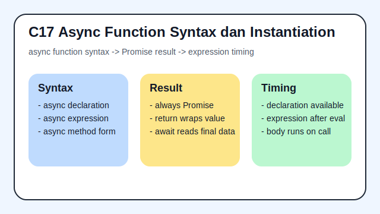

# C17 - Async Function Definitions Syntax dan Instantiation

## Tujuan

Bab ini bertujuan memahami sintaks dan instansiasi async function.

## Kenapa Bab Ini Penting

Async function menjadi pintu utama untuk menulis alur asynchronous yang lebih terbaca. Bab ini penting karena sebelum membahas evaluasi body-nya, kita perlu paham dulu bentuk sintaks yang valid, apa yang sebenarnya dikembalikan async function, dan bagaimana function itu dibentuk saat runtime.

## Konsep Inti

1. Async function ditulis dengan `async function` dan selalu mengembalikan Promise.
2. Instansiasi async function declaration mirip function biasa, tetapi body-nya dievaluasi dalam model Promise.
3. Bentuk declaration dan async method perlu dibedakan dari sisi lokasi penulisannya, walau sama-sama menghasilkan Promise saat dipanggil.

## Analogi Singkat

Bayangkan async function seperti mengambil nomor pesanan di kedai minuman. Saat kamu memesan, kamu belum langsung menerima minumannya; kamu menerima tanda bahwa pesanan sedang diproses dan hasilnya akan datang belakangan. Dalam JavaScript, tanda itu adalah Promise yang langsung dikembalikan oleh async function saat dipanggil.

Contoh singkat:

```js
async function getName() {
  return 'Syahputra';
}
```

## Praktik yang Direkomendasikan

- Cek hasil pemanggilan async function dengan `.then()` atau `await`, bukan dengan asumsi nilai langsung.
- Bedakan tahap pembentukan function dari tahap eksekusi body.
- Uji contoh kecil untuk melihat bahwa `return` biasa di async function tetap dibungkus Promise.

## Kesalahan Umum

- Mengira async function bisa dibaca seperti function sinkron biasa.
- Mengira async function declaration langsung mengembalikan nilai final, bukan Promise.
- Mencampur pemahaman async function declaration dengan async method pada object atau class.

## Checkpoint Cepat

1. Apa hasil pemanggilan async function sebelum di-`await`?
2. Kenapa `return 42` di async function tetap menghasilkan Promise?
3. Apa beda async function declaration dan async method dari sisi bentuk penulisannya?

## Ringkasan

- Async function memperluas function biasa dengan hasil Promise secara default.
- Memahami sintaks dan instansiasi async function memudahkan pembacaan evaluasi body pada bab berikutnya.
- Dasar ini juga menjadi fondasi untuk async arrow function.

## Spec Coverage

Bab ini terutama selaras dengan section ECMAScript berikut:

- `15.8`
- `15.8.1`
- `15.8.2`

Referensi mapping penuh: `../docs/spec-mapping-70.md`.

## Visual Map



## Contoh Runnable

- Lihat contoh: `../examples/C17-async-function-definitions-syntax-dan-instantiation/example.js`
- Lihat contoh tambahan: `../examples/C17-async-function-definitions-syntax-dan-instantiation/example-02.js`
- Lihat contoh tambahan: `../examples/C17-async-function-definitions-syntax-dan-instantiation/example-03.js`
- Panduan: `../examples/C17-async-function-definitions-syntax-dan-instantiation/README.md`
