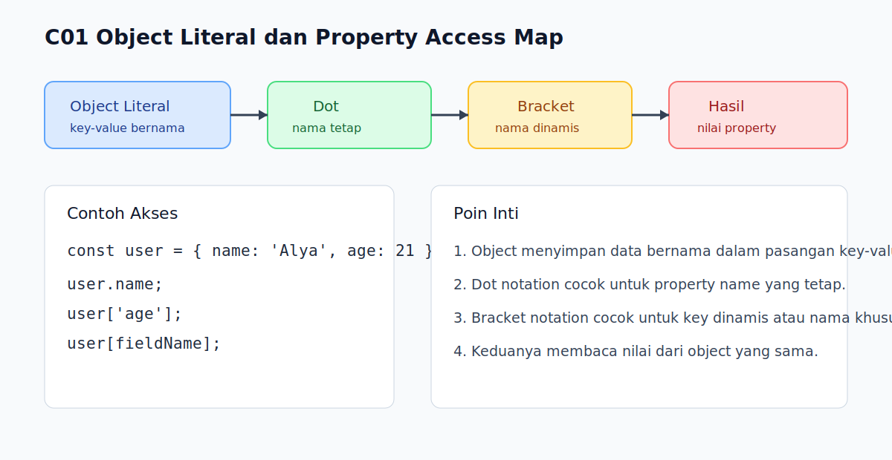

# C01 - Object Literal dan Property Access

## Tujuan

Bab ini bertujuan memahami object literal sebagai cara paling dasar menyusun data bernama di JavaScript.

## Kenapa Bab Ini Penting

Begitu data tidak lagi cukup disimpan sebagai satu nilai tunggal, kita hampir selalu mulai memakai object. Pemahaman object literal dan property access juga menjadi dasar saat nanti membaca response API, konfigurasi, atau state aplikasi.

## Konsep Inti

### 1. Object Menyimpan Pasangan Key-Value

```js
const user = {
  name: 'Alya',
  age: 21,
  isActive: true
};
```

Object membantu kita memberi nama pada setiap bagian data.

### 2. Property Bisa Diakses dengan `.` dan `[]`

```js
console.log(user.name);
console.log(user['age']);
```

- `.` cocok saat nama property sudah jelas dan valid sebagai identifier.
- `[]` cocok saat nama property dinamis atau memakai spasi/karakter khusus.

### 3. Nama Property Dinamis Lebih Nyaman dengan `[]`

```js
const fieldName = 'isActive';
console.log(user[fieldName]);
```

Jika nama property datang dari variabel, `.` tidak bisa dipakai langsung.

## Praktik yang Direkomendasikan

- Pakai `.` untuk akses normal agar kode lebih mudah dibaca.
- Pakai `[]` saat property name berasal dari variabel.
- Kelompokkan data yang saling terkait dalam satu object kecil.

## Kesalahan Umum

- Mengira `user.fieldName` akan membaca isi variabel `fieldName`.
- Mencampur object dengan array padahal kebutuhan datanya bukan daftar berurutan.
- Membuat object terlalu besar sejak awal tanpa struktur yang jelas.

## Checkpoint Cepat

1. Kapan sebaiknya memakai `.` dan kapan memakai `[]`?
2. Kenapa `user.fieldName` berbeda dari `user[fieldName]`?
3. Kapan object lebih cocok daripada beberapa variabel terpisah?

## Analogi Singkat

Object seperti laci berlabel: tiap laci punya nama dan isi. Kita bisa membuka laci langsung dengan nama tetap, atau mencari labelnya lewat catatan terpisah.

## Ringkasan

- Object literal menyusun data dalam pasangan key-value.
- `.` dipakai untuk property name yang tetap dan jelas.
- `[]` dipakai untuk property name dinamis atau tidak cocok dengan aturan identifier.

## Visual Map



## Contoh Runnable

- Lihat contoh: `../examples/C01-object-literal-dan-property-access/example.js`
- Lihat contoh tambahan: `../examples/C01-object-literal-dan-property-access/example-02.js`
- Lihat contoh tambahan: `../examples/C01-object-literal-dan-property-access/example-03.js`
- Panduan: `../examples/C01-object-literal-dan-property-access/README.md`
