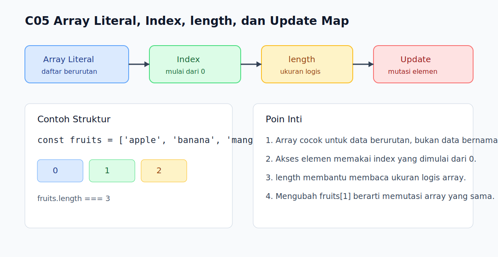

# C05 - Array Literal, Index, `length`, dan Update

## Tujuan

Bab ini bertujuan memahami array sebagai struktur data berurutan yang diakses lewat index.

## Kenapa Bab Ini Penting

Saat kita menyimpan daftar item, object bukan alat yang paling nyaman. Array dipakai di hampir semua program JavaScript, dari daftar tugas sampai hasil `map()` dan data API.

## Konsep Inti

### 1. Array Menyimpan Data Berdasarkan Urutan

```js
const fruits = ['apple', 'banana', 'mango'];
```

Setiap elemen punya posisi numerik mulai dari `0`.

### 2. Index Dimulai dari Nol

```js
console.log(fruits[0]); // apple
console.log(fruits[1]); // banana
```

Ini adalah salah satu sumber bug pemula yang paling sering.

### 3. `length` Menunjukkan Ukuran Logis Array

```js
console.log(fruits.length); // 3
```

Property `length` membantu saat membaca batas iterasi atau menambah elemen baru.

### 4. Elemen Array Bisa Diubah Langsung

```js
fruits[1] = 'grape';
```

Perubahan ini memutasi array yang sama.

## Praktik yang Direkomendasikan

- Selalu cek `length` saat menulis loop manual.
- Pakai nama variabel jamak untuk menandai bahwa nilainya array.
- Pisahkan kasus "satu item" dari "daftar item" agar struktur data tidak rancu.

## Kesalahan Umum

- Menganggap elemen pertama ada di index `1`.
- Mengakses index yang tidak ada lalu bingung karena hasilnya `undefined`.
- Lupa bahwa mengubah elemen berarti memutasi array asli.

## Checkpoint Cepat

1. Kenapa elemen pertama array ada di index `0`?
2. Apa arti `length` pada array?
3. Apa yang terjadi jika kita membaca `fruits[10]` saat elemennya belum ada?

## Analogi

- Intuisi Singkat: Array adalah daftar berurutan yang dibaca lewat nomor posisi.
- Analogi: Seperti rak sepatu berjajar; kita mengambil item berdasarkan nomor slot, bukan nama label.
- Batas Analogi: Slot array bisa kosong atau belum terisi, sehingga membaca posisi tertentu bisa menghasilkan `undefined`.

## Ringkasan

- Array cocok untuk data berbentuk daftar berurutan.
- Akses elemen dilakukan dengan index yang dimulai dari `0`.
- `length` dan update index adalah fondasi sebelum belajar iterasi dan method array.

## Visual Map



## Contoh Runnable

- Lihat contoh: `../examples/C05-array-literal-index-length-dan-update/example.js`
- Lihat contoh tambahan: `../examples/C05-array-literal-index-length-dan-update/example-02.js`
- Lihat contoh tambahan: `../examples/C05-array-literal-index-length-dan-update/example-03.js`
- Panduan: `../examples/C05-array-literal-index-length-dan-update/README.md`
