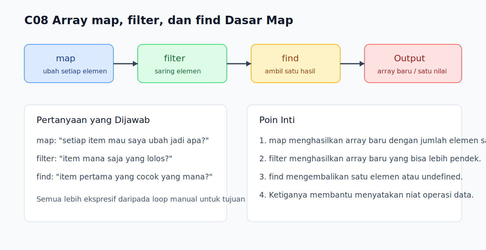

# C08 - Array `map`, `filter`, dan `find` Dasar

## Tujuan

Bab ini bertujuan memahami tiga built-in array dasar untuk transformasi, penyaringan, dan pencarian data.

## Kenapa Bab Ini Penting

Setelah pembaca bisa mengiterasi array secara manual, langkah berikutnya adalah memakai built-in yang lebih ekspresif. `map()`, `filter()`, dan `find()` sangat sering dipakai karena membantu kita menyatakan tujuan operasi data dengan lebih jelas daripada loop biasa.

## Konsep Inti

### 1. `map()` Mengubah Setiap Elemen Menjadi Nilai Baru

```js
const numbers = [1, 2, 3];
const doubled = numbers.map((number) => number * 2);

console.log(doubled);
```

`map()` menghasilkan array baru dengan jumlah elemen yang sama.

### 2. `filter()` Menyaring Elemen yang Lolos Kondisi

```js
const scores = [40, 75, 90, 55];
const passed = scores.filter((score) => score >= 70);

console.log(passed);
```

`filter()` juga menghasilkan array baru, tetapi jumlah elemennya bisa lebih sedikit.

### 3. `find()` Mencari Satu Elemen Pertama yang Cocok

```js
const users = ['Alya', 'Budi', 'Sari'];
const result = users.find((user) => user.startsWith('S'));

console.log(result);
```

Jika tidak ada elemen yang cocok, `find()` menghasilkan `undefined`.

## Praktik yang Direkomendasikan

- Pakai `map()` saat tujuan utamanya adalah mengubah bentuk data.
- Pakai `filter()` saat ingin mempertahankan hanya sebagian elemen.
- Pakai `find()` saat hanya perlu satu hasil pertama yang cocok.

## Kesalahan Umum

- Mengira `map()` mengubah array lama secara langsung.
- Menggunakan `filter()` padahal sebenarnya hanya butuh satu item.
- Lupa bahwa `find()` bisa mengembalikan `undefined`.

## Checkpoint Cepat

1. Apa beda utama `map()` dan `filter()`?
2. Kapan `find()` lebih tepat daripada `filter()`?
3. Kenapa tiga method ini terasa lebih jelas daripada loop manual pada banyak kasus?

## Analogi

- Intuisi Singkat: Tiga method ini membantu kita menyatakan niat saat memproses daftar.
- Analogi: Seperti meja sortir barang; kita bisa mengubah label semua barang, memisahkan yang lolos kriteria, atau mencari satu barang tertentu.
- Batas Analogi: Di JavaScript, hasil `map()` dan `filter()` adalah array baru, sedangkan `find()` hanya mengembalikan satu elemen atau `undefined`.

## Ringkasan

- `map()` dipakai untuk transformasi setiap elemen.
- `filter()` dipakai untuk menyaring elemen sesuai kondisi.
- `find()` dipakai untuk mengambil elemen pertama yang cocok.

## Visual Map



## Contoh Runnable

- Lihat contoh: `../examples/C08-array-map-filter-dan-find-dasar/example.js`
- Lihat contoh tambahan: `../examples/C08-array-map-filter-dan-find-dasar/example-02.js`
- Lihat contoh tambahan: `../examples/C08-array-map-filter-dan-find-dasar/example-03.js`
- Panduan: `../examples/C08-array-map-filter-dan-find-dasar/README.md`
