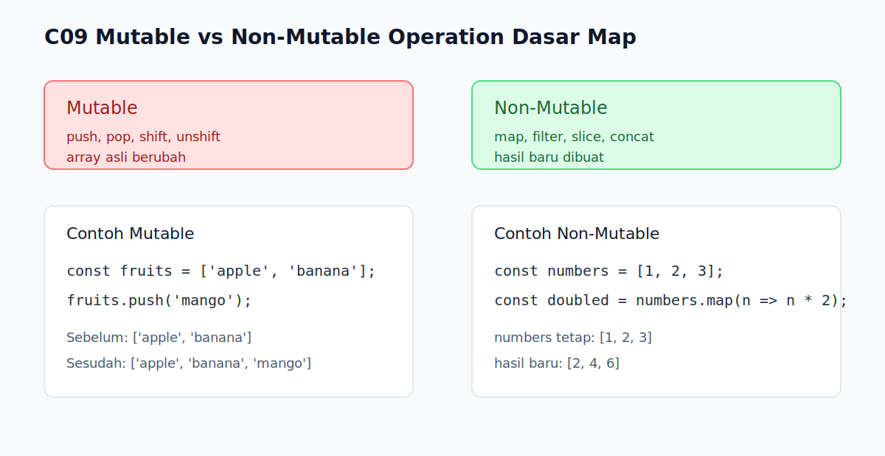

# C09 - Mutable vs Non-Mutable Operation Dasar

## Tujuan

Bab ini bertujuan membedakan operasi array yang mengubah data asli dan operasi yang menghasilkan data baru.

## Kenapa Bab Ini Penting

Setelah pembaca mengenal `push()`, `pop()`, `map()`, dan `filter()`, muncul satu pertanyaan penting: mana operasi yang mengubah array lama, dan mana yang tidak? Ini adalah model mental kunci untuk mencegah bug saat data dipakai di banyak bagian program.

## Konsep Inti

### 1. Operasi Mutable Mengubah Array Asli

```js
const fruits = ['apple', 'banana'];

fruits.push('mango');
console.log(fruits);
```

Method seperti `push()`, `pop()`, `shift()`, dan `unshift()` langsung mengubah isi array yang sama.

### 2. Operasi Non-Mutable Menghasilkan Array Baru

```js
const numbers = [1, 2, 3];
const doubled = numbers.map((number) => number * 2);

console.log(numbers);
console.log(doubled);
```

`map()`, `filter()`, `slice()`, dan `concat()` adalah contoh umum operasi yang tidak mengubah array asli.

### 3. Penting Membedakan "Data Lama Berubah" vs "Data Baru Dibuat"

```js
const original = ['a', 'b'];
const copied = original.slice();
```

Kalau tujuannya menjaga data awal tetap utuh, operasi non-mutable biasanya lebih aman.

## Praktik yang Direkomendasikan

- Pakai operasi mutable saat memang ingin memperbarui array yang sama.
- Pakai operasi non-mutable saat ingin menjaga data awal tetap mudah dilacak.
- Biasakan membaca dokumentasi method dengan pertanyaan: "apakah ini mengubah array lama?"

## Kesalahan Umum

- Mengira semua method array mengubah data asli.
- Tidak sadar bahwa perubahan mutable terlihat juga oleh referensi lain ke array yang sama.
- Menimpa variabel hasil operasi non-mutable lalu lupa bahwa array awal sebenarnya tidak berubah.

## Checkpoint Cepat

1. Mengapa `push()` dan `map()` terasa mirip sebagai "operasi array", tetapi perilakunya berbeda?
2. Kapan operasi non-mutable lebih aman dipilih?
3. Apa risiko jika kita salah menebak sebuah method ternyata mutable?

## Analogi

- Intuisi Singkat: Ada operasi yang merombak daftar lama, ada operasi yang membuat salinan hasil baru.
- Analogi: Seperti mengedit daftar belanja asli dengan pena versus memfotokopi daftar lalu menandai versi salinannya.
- Batas Analogi: Walau operasi non-mutable menghasilkan array baru, elemen di dalamnya tetap bisa berupa nilai atau referensi yang punya perilaku tersendiri.

## Ringkasan

- Operasi mutable mengubah array asli secara langsung.
- Operasi non-mutable menghasilkan array baru dan biasanya lebih aman untuk menjaga jejak data.
- Memahami perbedaan ini membantu mencegah bug saat data dipakai ulang.

## Visual Map



## Contoh Runnable

- Lihat contoh: `../examples/C09-mutable-vs-non-mutable-operation-dasar/example.js`
- Lihat contoh tambahan: `../examples/C09-mutable-vs-non-mutable-operation-dasar/example-02.js`
- Lihat contoh tambahan: `../examples/C09-mutable-vs-non-mutable-operation-dasar/example-03.js`
- Panduan: `../examples/C09-mutable-vs-non-mutable-operation-dasar/README.md`
