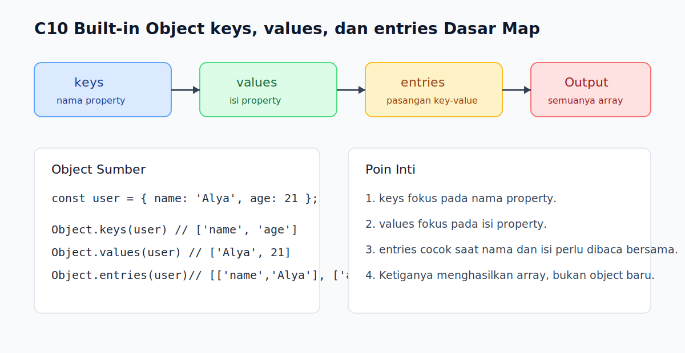

# C10 - Built-in Object: `keys`, `values`, dan `entries`

## Tujuan

Bab ini bertujuan memahami built-in `Object.keys()`, `Object.values()`, dan `Object.entries()` untuk membaca struktur data object secara sistematis.

## Kenapa Bab Ini Penting

Saat object mulai berisi banyak property, kita butuh cara yang lebih rapi daripada mengakses semuanya satu per satu. Jika di bab awal pembaca baru melihat iterasi object dasar, di sini pembaca naik level ke tiga built-in yang lebih eksplisit untuk inspeksi data, menampilkan isi object, atau menyiapkan iterasi lanjutan.

## Konsep Inti

### 1. `Object.keys()` Mengambil Daftar Nama Property

```js
const user = { name: 'Alya', age: 21, city: 'Bandung' };

console.log(Object.keys(user));
```

Hasilnya adalah array berisi nama-nama property.

### 2. `Object.values()` Mengambil Daftar Nilai Property

```js
console.log(Object.values(user));
```

Method ini berguna saat kita lebih peduli pada isi data daripada nama propertinya.

### 3. `Object.entries()` Mengambil Pasangan Key-Value

```js
console.log(Object.entries(user));
```

Setiap elemen hasilnya berbentuk array dua item: `[key, value]`.

## Praktik yang Direkomendasikan

- Gunakan `Object.keys()` saat fokusnya nama property.
- Gunakan `Object.values()` saat fokusnya kumpulan nilai.
- Gunakan `Object.entries()` saat kita perlu membaca nama dan nilai sekaligus.

## Kesalahan Umum

- Mengira hasilnya tetap object, padahal ketiganya menghasilkan array.
- Lupa bahwa `entries()` memberi pasangan `[key, value]`, bukan object kecil.
- Memilih `keys()` lalu tetap mengambil nilai manual padahal `entries()` lebih langsung.

## Checkpoint Cepat

1. Apa beda hasil `Object.keys()` dan `Object.values()`?
2. Kapan `Object.entries()` terasa paling nyaman dipakai?
3. Kenapa penting sadar bahwa hasil ketiga method ini berbentuk array?

## Analogi

- Intuisi Singkat: Tiga built-in ini membantu melihat object dari tiga sudut yang berbeda.
- Analogi: Seperti daftar inventaris; kita bisa melihat daftar label barang, daftar isinya, atau pasangan label-beserta-isinya.
- Batas Analogi: Di JavaScript, hasil baca itu berupa array, sehingga kita bisa lanjut memprosesnya dengan built-in array jika perlu.

## Ringkasan

- `Object.keys()` menghasilkan array nama property.
- `Object.values()` menghasilkan array nilai property.
- `Object.entries()` menghasilkan array pasangan key-value.

## Visual Map



## Contoh Runnable

- Lihat contoh: `../examples/C10-built-in-object-keys-values-entries-dasar/example.js`
- Lihat contoh tambahan: `../examples/C10-built-in-object-keys-values-entries-dasar/example-02.js`
- Lihat contoh tambahan: `../examples/C10-built-in-object-keys-values-entries-dasar/example-03.js`
- Panduan: `../examples/C10-built-in-object-keys-values-entries-dasar/README.md`
