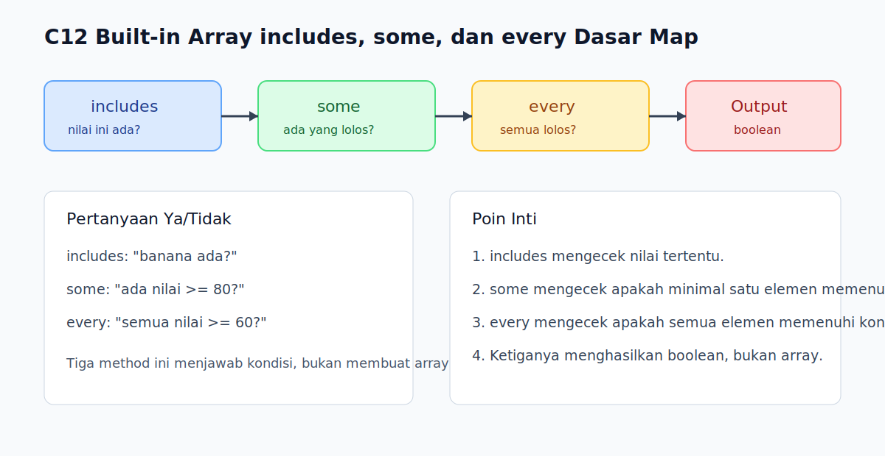

# C12 - Built-in Array: `includes`, `some`, dan `every`

## Tujuan

Bab ini bertujuan memahami built-in array dasar untuk mengecek keberadaan nilai dan kondisi elemen.

## Kenapa Bab Ini Penting

Dalam pekerjaan sehari-hari, kita sering bertanya: "apakah nilai ini ada di daftar?", "apakah ada item yang lolos syarat?", atau "apakah semua item memenuhi aturan?". `includes()`, `some()`, dan `every()` membantu menjawab pertanyaan itu dengan lebih jelas daripada loop manual.

## Konsep Inti

### 1. `includes()` Mengecek Apakah Nilai Ada di Array

```js
const fruits = ['apple', 'banana', 'mango'];

console.log(fruits.includes('banana'));
```

Hasilnya berupa boolean: `true` atau `false`.

### 2. `some()` Mengecek Apakah Ada Minimal Satu Elemen yang Lolos Kondisi

```js
const scores = [40, 75, 90];

console.log(scores.some((score) => score >= 80));
```

Jika setidaknya satu elemen cocok, hasilnya `true`.

### 3. `every()` Mengecek Apakah Semua Elemen Lolos Kondisi

```js
console.log(scores.every((score) => score >= 60));
```

Jika ada satu saja yang tidak cocok, hasilnya `false`.

## Praktik yang Direkomendasikan

- Gunakan `includes()` untuk pencarian nilai sederhana.
- Gunakan `some()` saat hanya perlu tahu ada atau tidak ada elemen yang cocok.
- Gunakan `every()` saat validasi berlaku untuk seluruh isi array.

## Kesalahan Umum

- Mengira `some()` dan `every()` mengembalikan array baru.
- Menggunakan `filter()` padahal hanya perlu jawaban boolean.
- Lupa membedakan pertanyaan "ada minimal satu?" dengan "semuanya?".

## Checkpoint Cepat

1. Apa beda utama `includes()` dan `some()`?
2. Kapan `every()` lebih tepat daripada `some()`?
3. Kenapa tiga method ini sering lebih jelas daripada loop manual untuk pengecekan kondisi?

## Analogi

- Intuisi Singkat: Tiga method ini membantu menjawab pertanyaan ya/tidak tentang isi daftar.
- Analogi: Seperti memeriksa daftar hadir; kita bisa cek apakah satu nama ada, apakah ada siswa yang terlambat, atau apakah semua siswa sudah hadir.
- Batas Analogi: Di JavaScript, hasil ketiganya bukan daftar baru, melainkan boolean yang langsung mewakili jawaban pengecekan.

## Ringkasan

- `includes()` mengecek keberadaan nilai tertentu.
- `some()` mengecek apakah ada minimal satu elemen yang memenuhi kondisi.
- `every()` mengecek apakah semua elemen memenuhi kondisi.

## Visual Map



## Contoh Runnable

- Lihat contoh: `../examples/C12-built-in-array-includes-some-dan-every-dasar/example.js`
- Lihat contoh tambahan: `../examples/C12-built-in-array-includes-some-dan-every-dasar/example-02.js`
- Lihat contoh tambahan: `../examples/C12-built-in-array-includes-some-dan-every-dasar/example-03.js`
- Panduan: `../examples/C12-built-in-array-includes-some-dan-every-dasar/README.md`
