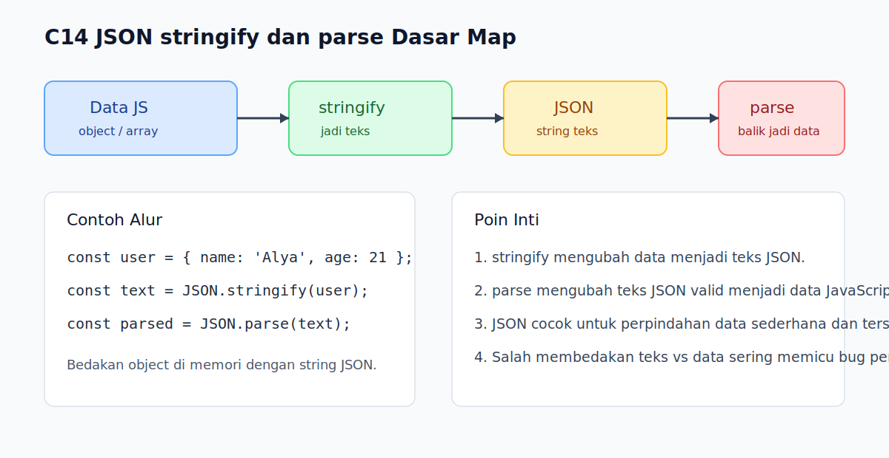

# C14 - JSON `stringify` dan `parse` Dasar

## Tujuan

Bab ini bertujuan memahami perpindahan data sederhana antara object JavaScript dan teks JSON.

## Kenapa Bab Ini Penting

Cepat atau lambat, pembaca akan bertemu data yang perlu disimpan, dikirim, atau dibaca dalam bentuk teks. Di situ `JSON.stringify()` dan `JSON.parse()` menjadi jembatan penting antara data JavaScript di memori dan representasi teks yang lebih mudah dipindahkan.

## Konsep Inti

### 1. `JSON.stringify()` Mengubah Data Menjadi Teks JSON

```js
const user = { name: 'Alya', age: 21 };
const text = JSON.stringify(user);

console.log(text);
```

Hasilnya adalah string, bukan object lagi.

### 2. `JSON.parse()` Mengubah Teks JSON Menjadi Data JavaScript

```js
const parsed = JSON.parse(text);

console.log(parsed);
```

Setelah diparse, data kembali bisa diakses seperti object biasa.

### 3. JSON Cocok untuk Data Sederhana dan Terstruktur

```js
const payload = {
  user: 'Alya',
  scores: [80, 90]
};
```

Object sederhana, array, string, number, boolean, dan `null` adalah bentuk yang paling umum dipertukarkan lewat JSON.

## Praktik yang Direkomendasikan

- Gunakan `JSON.stringify()` saat butuh representasi teks dari data.
- Gunakan `JSON.parse()` saat menerima teks JSON yang valid dan ingin mengubahnya kembali menjadi data.
- Selalu bedakan dengan sadar antara object JavaScript dan string JSON.

## Kesalahan Umum

- Mengira hasil `JSON.stringify()` masih bisa diakses seperti object.
- Lupa bahwa `JSON.parse()` membutuhkan string JSON yang valid.
- Mencampur istilah "object" dan "JSON" seolah keduanya selalu sama.

## Checkpoint Cepat

1. Apa beda hasil `JSON.stringify(user)` dan object `user` itu sendiri?
2. Kapan `JSON.parse()` diperlukan?
3. Kenapa penting membedakan teks JSON dengan data JavaScript di memori?

## Analogi

- Intuisi Singkat: JSON membantu data berpindah dari bentuk kerja ke bentuk kirim, lalu kembali lagi.
- Analogi: Seperti mengemas barang ke dalam kotak berlabel untuk dikirim, lalu membuka kembali isi kotak itu di tujuan.
- Batas Analogi: Di JavaScript, hasil pengemasan `stringify()` adalah string teks, sedangkan `parse()` membangun ulang struktur datanya agar bisa dipakai lagi.

## Ringkasan

- `JSON.stringify()` mengubah data JavaScript menjadi string JSON.
- `JSON.parse()` mengubah string JSON valid menjadi data JavaScript.
- Memahami beda data dan teks JSON mencegah banyak bug pemula.

## Visual Map



## Contoh Runnable

- Lihat contoh: `../examples/C14-json-stringify-dan-parse-dasar/example.js`
- Lihat contoh tambahan: `../examples/C14-json-stringify-dan-parse-dasar/example-02.js`
- Lihat contoh tambahan: `../examples/C14-json-stringify-dan-parse-dasar/example-03.js`
- Panduan: `../examples/C14-json-stringify-dan-parse-dasar/README.md`
