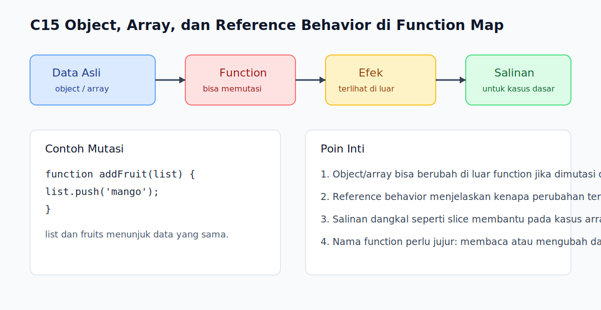

# C15 - Object, Array, dan Reference Behavior di Function

## Tujuan

Bab ini bertujuan memahami kenapa object dan array bisa terlihat berubah setelah melewati function.

## Kenapa Bab Ini Penting

Ini adalah salah satu sumber kebingungan terbesar bagi pemula. Banyak pembaca merasa "kok data berubah di luar function padahal saya ubah di dalam?" Jawabannya berkaitan dengan cara object dan array dipakai melalui reference yang mengarah ke data yang sama.

## Konsep Inti

### 1. Function Menerima Akses ke Object atau Array yang Sama

```js
const user = { name: 'Alya' };

function updateUser(data) {
  data.name = 'Budi';
}

updateUser(user);
console.log(user.name);
```

Perubahan property di dalam function terlihat juga di luar karena object yang dipakai tetap object yang sama.

### 2. Hal yang Sama Terjadi pada Array

```js
const fruits = ['apple', 'banana'];

function addFruit(list) {
  list.push('mango');
}
```

Jika array dimutasi di dalam function, hasilnya terlihat juga di luar.

### 3. Menyalin Data Bisa Membantu Menghindari Perubahan Tak Sengaja

```js
const copied = fruits.slice();
```

Kalau niatnya hanya membaca atau membuat versi baru, lebih aman bekerja pada salinan. Untuk level dasar buku ini, `slice()` cukup berguna sebagai salinan dangkal pada array satu lapis.

## Praktik yang Direkomendasikan

- Curigai operasi mutable saat data berubah "tanpa sadar".
- Buat salinan sederhana sebelum mutasi jika data awal perlu dipertahankan.
- Pilih nama function yang jelas apakah ia "membaca" data atau "mengubah" data.

## Kesalahan Umum

- Mengira object atau array otomatis disalin saat dikirim ke function.
- Lupa bahwa `push()` atau perubahan property di dalam function memengaruhi data luar.
- Sulit melacak bug karena function bernama netral padahal diam-diam memutasi argumen.
- Mengira salinan sederhana seperti `slice()` akan melindungi semua bentuk data bertingkat.

## Checkpoint Cepat

1. Kenapa perubahan object di dalam function bisa terlihat di luar?
2. Kapan membuat salinan array atau object menjadi ide yang lebih aman?
3. Apa tanda-tanda bahwa bug yang muncul terkait reference behavior?

## Analogi

- Intuisi Singkat: Dua bagian kode bisa memegang akses ke benda yang sama.
- Analogi: Seperti dua orang memegang alamat rumah yang sama; jika salah satu masuk dan memindahkan kursi, orang lain akan melihat rumah itu sudah berubah.
- Batas Analogi: Di JavaScript, yang dibagikan bukan "rumah baru", melainkan akses ke data yang sama, sehingga mutasi terlihat dari banyak tempat.

## Ringkasan

- Object dan array bisa berubah di luar function jika dimutasi di dalam function.
- Reference behavior penting untuk memahami bug data yang terasa "misterius".
- Membuat salinan dangkal adalah salah satu cara paling sederhana untuk menjaga data awal tetap aman pada kasus dasar.

## Visual Map



## Contoh Runnable

- Lihat contoh: `../examples/C15-object-array-dan-reference-behavior-di-function/example.js`
- Lihat contoh tambahan: `../examples/C15-object-array-dan-reference-behavior-di-function/example-02.js`
- Lihat contoh tambahan: `../examples/C15-object-array-dan-reference-behavior-di-function/example-03.js`
- Panduan: `../examples/C15-object-array-dan-reference-behavior-di-function/README.md`
