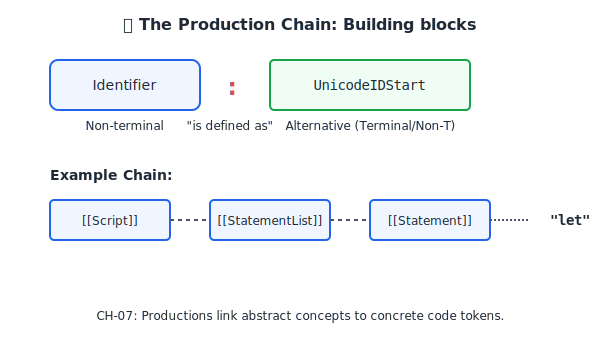

# CH-07: Nonterminal Symbols and Productions

Bagaimana konsep besar (seperti "Statement") dibangun? (Clause 5.1.5.2).

## Dasar Pemikiran: "Rantai Komando" 🖇️
Jika Terminal adalah "prajurit" di lapangan (kode riil), maka **Nonterminal Symbols** adalah "komandan" yang memberikan instruksi strategis. Sebuah **Production** adalah aturan yang menjelaskan bagaimana seorang komandan (Nonterminal) bisa mendelegasikan tugasnya kepada komandan lain atau langsung ke prajurit (Terminal).

---

## 1. Nonterminal Symbols (Abstraksi)
Nonterminal adalah nama kategori yang mewakili kumpulan simbol lain. Ciri khasnya dalam spesifikasi:
- **Font Italic**: Ditulis miring (Contoh: *Expression*, *Statement*, *PrimaryExpression*).
- **Placeholder**: Bertindak sebagai wadah yang belum final; ia harus "diulas" atau "diekspansi" sampai menjadi terminal.

## 2. Struktur Produksi
Sebuah produksi mendefinisikan hubungan antara Nonterminal (sisi kiri) dan alternatif penyusunnya (sisi kanan).
`NonterminalSymbol : [Satu atau lebih alternatif]`

Contoh:
`AdditiveExpression :`
  `MultiplicativeExpression`
  `AdditiveExpression + MultiplicativeExpression`

Artinya: Sebuah ekspresi penambahan bisa berupa ekspresi perkalian saja, ATAU gabungan ekspresi penambahan lain yang diikuti tanda `+` (Terminal) dan ekspresi perkalian.

---

## Arsitek Mindset: The Recursive Blueprint
Seorang arsitek melihat spesifikasi sebagai sistem rekursif. Satu aturan bisa memanggil aturan lain, yang mungkin memanggil kembali aturan pertama. Pemahaman tentang rantai produksi ini memungkinkan Anda melacak alur evaluasi kode dari level tertinggi (*Script*) hingga level terendah (karakter Unicode).

[Lihat Simulasi Rantai Produksi](./examples/production_chain.js)

---
> [!TIP]
> Saat membaca spec, anggaplah tanda `:` sebagai operator penugasan (`=`) dalam pemrograman, di mana sisi kiri didefinisikan oleh kombinasi simbol di sisi kanan.
