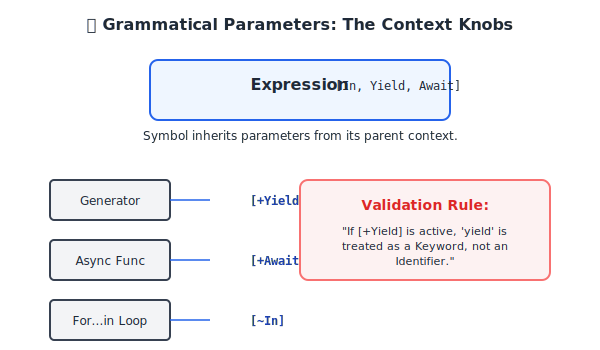

# CH-09: Grammatical Parameters

Notasi paling canggih untuk mengontrol variasi aturan. (Clause 5.1.5.4).

## Dasar Pemikiran: "Tombol Konteks" 🎛️
Pernahkah Anda bertanya-tanya bagaimana JavaScript tahu bahwa keyword `yield` dilarang digunakan sebagai nama variabel di dalam generator, tetapi diperbolehkan di luar generator? Spesifikasi mengaturnya menggunakan **Grammatical Parameters**. Anggap ini sebagai saklar (switch) yang menyalakan atau mematikan aturan tertentu berdasarkan di mana kita berada.

---

## 1. Simbol Berparameter
Dalam spesifikasi, Nonterminal sering diikuti oleh daftar parameter dalam tanda kurung siku:
`Nonterminal[In, Yield, Await] : [Alternative]`

Parameter utama meliputi:
- **`[In]`**: Membatasi penggunaan operator `in` (penting untuk parsing `for...in` loops).
- **`[Yield]`**: Menentukan apakah `yield` dianggap instruksi khusus atau teks biasa.
- **`[Await]`**: Serupa dengan Yield, tetapi untuk konteks fungsi asinkron.

## 2. Mekanisme "Penularan" Konteks
Parameter ini bekerja secara hierarkis. Jika sebuah fungsi didefinisikan sebagai `async`, maka seluruh pohon syntax di bawahnya akan "tertular" parameter `[Await]`. Ini memungkinkan spesifikasi menerapkan aturan yang konsisten di seluruh aplikasi tanpa harus mengecek kondisi secara manual di setiap baris.

---

## Arsitek Mindset: Context-Aware Design
Seorang arsitek tingkat senior memahami bahwa "kebenaran" sebuah kode bergantung pada konteksnya. Memahami Grammatical Parameters memungkinkan Anda menghindari bug syntax yang membingungkan. Anda akan tahu persis *kenapa* kode yang terlihat benar bisa mendadak error hanya karena dipindahkan ke dalam blok `async` atau `generator`.

[Lihat Simulasi Konteks Parameter](./examples/parameter_context_sim.js)

---
> [!IMPORTANT]
> Grammatical Parameters adalah cara spesifikasi ECMAScript menjaga agar bahasanya tetap ekspresif namun tetap aman dan tidak ambigu di berbagai skenario eksekusi.
