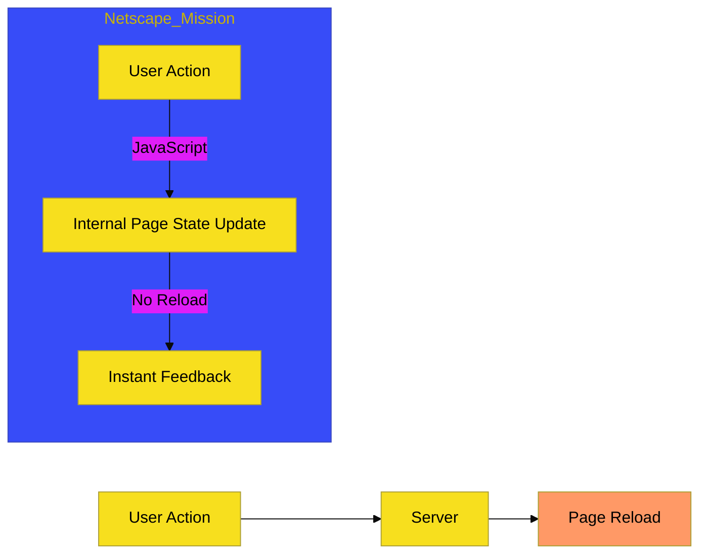

# CH-01: The Netscape Mission (1995)

> **"Misi Perekat Web Statis: Kelahiran Interaktivitas."**

---

## 🔗 Source Hub
- **Primary Source**: [MDN Web Docs - JavaScript History](https://developer.mozilla.org/en-US/docs/Web/JavaScript/About_JavaScript)
- **Archive**: [Netscape Press Release (1995)](https://web.archive.org/web/20141026071413/http://wp.netscape.com/newsref/pr/newsrelease67.html)

---

## 🌓 1. Essence: The Logic
Pada era awal (1990-an), web bersifat sepenuhnya statis. Netscape Communications menyadari perlunya sebuah **"bahasa perekat" (glue language)** untuk memberikan interaktivitas langsung di sisi klien tanpa harus memuat ulang (reload) halaman dari server.

Tanpa misi Netscape ini, web mungkin masih didominasi oleh teknologi yang jauh lebih berat dan kaku seperti *Java Applets* bahkan untuk interaksi UI yang paling sederhana.

### Terminologi Utama (Senior Terms)
- **Static Web Crisis**: Keterbatasan dinamisme web awal yang menghambat *User Experience*.
- **Client-Side Scripting**: Eksekusi skrip langsung di browser pengguna untuk respons instan.
- **Glue Language**: Bahasa penghubung untuk mengontrol komponen (HTML, Gambar, Applets).

---

## 🎨 2. Visual Logic: The Shift
Transisi dari Web Statis ke Interaktif (Client-Side):

---

## ⚠️ 3. Common Pitfalls & Myths
- **Mitos**: JavaScript hanya diciptakan untuk efek visual sederhana. (Faktanya ia dirancang sebagai bahasa fungsional yang kuat yang mampu mengelola state UI secara asinkron).

---
*Back to [The Ten Day Legend](../README.md)*
