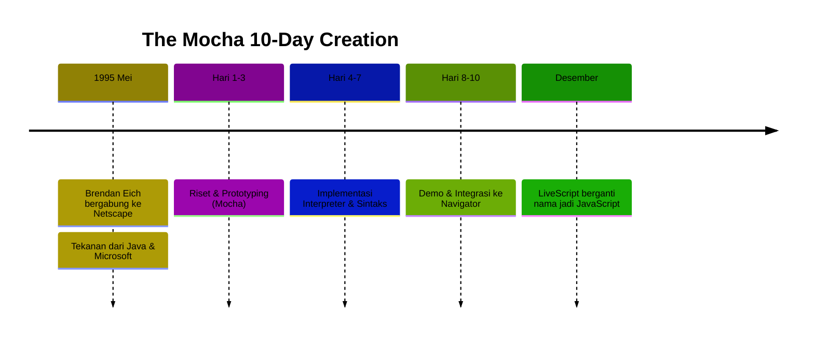

# BK-01: The Ten Day Legend

> **"Kisah Penciptaan Paling Ikonik: 10 Hari yang Mengubah Selamanya."**

---

## 🔗 Source Hub
- **Primary Account**: [Brendan Eich's Blog - 10 Days](https://brendaneich.com/2011/06/new-javascript-engine-module-owner/)
- **Documentation**: [The Early History of JavaScript (Computer History Museum)](https://history.computer.org/pople/2020/eich.html)
- **Archive**: [Netscape Press Release (1995)](https://web.archive.org/web/20141026071413/http://wp.netscape.com/newsref/pr/newsrelease67.html)

---

## 🌓 1. Essence: The Narrative
JavaScript lahir dari sebuah misi yang mustahil: menciptakan bahasa skrip hanya dalam waktu 10 hari untuk browser Netscape Navigator 2.0. Nama aslinya adalah **Mocha**, kemudian **LiveScript**, dan akhirnya **JavaScript** sebagai bentuk aliansi pemasaran dengan Java milik Sun Microsystems.

Esensi buku ini adalah untuk menghargai keputusan desain awal (seperti *Prototypal Inheritance*) yang meskipun dibuat dengan sangat cepat, terbukti memiliki daya tahan ekosistem selama puluhan tahun.

---

## 🗺️ 2. Landscape: The Big Picture
Buku ini adalah titik awal absolut. Tanpa memahami ketergesa-gesaan Netscape menghadapi Microsoft (Internet Explorer), kita tidak akan mengerti mengapa beberapa fitur JavaScript terasa "unik" atau bahkan "aneh" di mata programmer bahasa sistem.

### 🎨 Visual Logic: The Timeline

### 🏛️ Table of Materials
| Bab | Judul | Status | Lab | Visual | Spec-Sync |
| :--- | :--- | :--- | :---: | :---: | :--- |
| **CH-01** | [The Netscape Mission](./CH-01_TheNetscapeMission/) | [x] Complete | Nil | [x] Mermaid | Historical |
| **CH-02** | [Brendan Eich's Vision](./CH-02_BrendanEichsVision/) | [ ] Draft | Nil | Nil | Historical |

---

## ⚠️ 3. Common Pitfalls & Myths
- **Mitos**: "JavaScript diciptakan 10 hari berarti kualitasnya buruk." (Kualitasnya sangat tinggi untuk jangka waktu tersebut).
- **Mitos**: "Java dan JavaScript adalah bahasa yang sama." (Sama sekali berbeda, hanya strategi pemasaran).

---
*Back to [RAK-01-introduction-essence](../README.md)*
