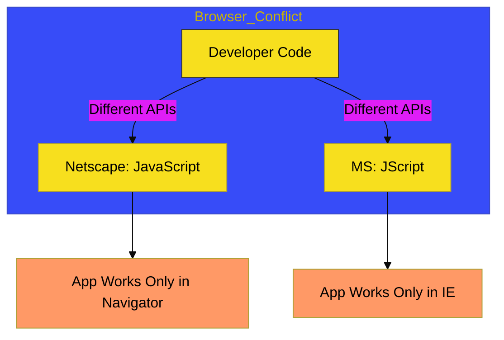

# CH-01: The Dark Ages (1995 - 2008)

> **"Era di Mana Web Adalah Medan Perang Tanpa Standar Tunggal."**

---

## 🔗 Source Hub
- **Archive**: [The Browser Wars History](https://en.wikipedia.org/wiki/Browser_wars)
- **Primary Source**: [JS History on MDN](https://developer.mozilla.org/en-US/docs/Web/JavaScript/About_JavaScript)

---

## 🌓 1. Essence: The Logic
Era Kegelapan (*The Dark Ages*) ditandai dengan ketidakkonsistenan yang parah di antara browser. Microsoft (Internet Explorer) merilis **JScript** sebagai tandingan balasan untuk **JavaScript** milik Netscape. Akibatnya, pengembang harus menulis kode yang berbeda untuk setiap browser, melahirkan era `if (document.all)` dan `if (document.layers)`.

Misi era ini adalah **Kelangsungan Hidup**. Tanpa desakan untuk standarisasi (ECMAScript), JavaScript hampir punah karena reputasinya sebagai bahasa yang "rusak" dan "lambat".

---

## 🎨 2. Visual Logic: The Browser War
Pemisahan implementasi di era 1990-an:

---

## ⚠️ 3. Common Pitfalls & Myths
- **Mitos**: "JScript dan JavaScript adalah hal yang sama." (Sama secara konsep, tapi implementasi API-nya sangat berbeda di masa lalu).
- **Mitos**: "Era ini tidak penting." (Era ini justru sangat krusial karena melahirkan **jQuery** dan usaha standarisasi TC39).

---
*Back to [Evolutionary Timeline](../README.md)*
