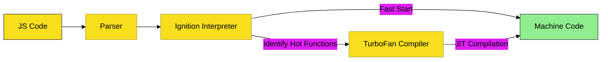

# CH-02: V8 Revolution & Node.js (2008 - 2012)

> **"Kelahiran Kecepatan: Transformasi Sepeda Jadi Mesin F1."**

---

## 🔗 Source Hub
- **V8 Engine**: [V8 Project - Blog History](https://v8.dev/blog)
- **Node.js**: [Node.js - Internal Architecture](https://nodejs.org/en/about)

---

## 🌓 1. Essence: The Logic
Tahun 2008 adalah titik balik fundamental. Google merilis **V8 Engine** yang tidak lagi sekadar menginterpretasi baris per baris, melainkan menggunakan teknik **JIT (Just-In-Time) Compilation**. Hal ini meningkatkan kecepatan JavaScript hingga ribuan kali lipat.

Puncaknya tahun 2009, Ryan Dahl membawa V8 keluar dari browser dan merilis **Node.js**, memungkinkan JavaScript menguasai backend enterprise.

---

## 🎨 2. Visual Logic: JIT Acceleration
Aliran eksekusi V8:

---

## ⚠️ 3. Common Pitfalls & Myths
- **Mitos**: "Node.js adalah bahasa pemrograman baru." (Sama sekali bukan, Node.js adalah **Runtime** yang menggunakan bahasa JavaScript).
- **Mitos**: "V8 hanya ada di Chrome." (Banyak runtime lain, seperti Node.js dan Electron, juga menggunakan V8).

---
*Back to [Evolutionary Timeline](../README.md)*
