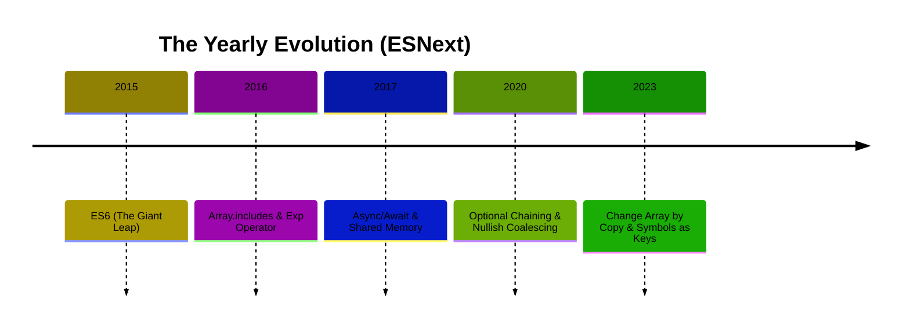

# CH-03: The Modern ECMAScript Era (2015+)

> **"Era Standarisasi: Menuju Kematangan Bahasa."**

---

## 🔗 Source Hub
- **TC39 proposals**: [TC39 - Finished Proposals](https://github.com/tc39/proposals/blob/main/finished-proposals.md)
- **ECMAScript Standard**: [ECMA-262 (Current Edition)](https://tc39.es/ecma262/)

---

## 🌓 1. Essence: The Logic
Tahun 2015, **ES6** (atau ES2015) merombak desain bahasa dengan fitur-fitur modern (Classes, Arrow Functions, Modules). Sejak itu, **TC39** merilis standar baru setiap Juni untuk menghindari "revolusi yang terlalu besar" dan menjaga ritme evolusi yang stabil.

Karakteristik era ini adalah **Spec-Rigor**. Setiap fitur baru sekarang melalui 4 tahap proposal yang ketat sebelum diimplementasikan oleh engine browser.

---

## 🎨 2. Visual Logic: The Yearly Rhythm
Siklus rilis ECMAScript modern:

---

## ⚠️ 3. Common Pitfalls & Myths
- **Mitos**: "ES6 adalah versi terakhir." (ES6 hanyalah awal dari era rilis tahunan).
- **Mitos**: "Setengah fitur baru tidak bisa dipakai." (Kita punya **Babel** dan **Polyfills** agar fitur terbaru tetap jalan di browser lama).

---
*Back to [Evolutionary Timeline](../README.md)*
