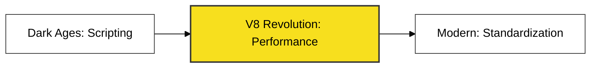

# BK-02: Evolutionary Timeline

> **"Dari Bahasa Skrip Sederhana Menjadi Penguasa Multi-runtime."**

---

## 🔗 Source Hub
- **TC39 Archive**: [TC39 - Finished Proposals](https://github.com/tc39/proposals/blob/main/finished-proposals.md)
- **Engine Evolution**: [V8 Project - Blog History](https://v8.dev/blog)
- **MDN History**: [A Brief History of JS](https://developer.mozilla.org/en-US/docs/Web/JavaScript/About_JavaScript)

---

## 🌓 1. Essence: The Narrative
Evolusi JavaScript adalah cerita tentang daya tahan (*resilience*). JavaScript tidak pernah berhenti berubah; ia bermutasi dari bahasa yang hanya bisa membuat peringatan (alert) sederhana di browser, menjadi bahasa yang menggerakkan sistem terdistribusi, kecerdasan buatan, dan aplikasi enterprise.

Buku ini membelah tiga era besar yang membentuk wajah sistem koding modern: **Era Kegelapan (Interoperabilitas)**, **Era Revolusi Mesin (V8)**, dan **Era Standarisasi (ECMAScript Modern)**.

---

## 🗺️ 2. Landscape: The Big Picture
Buku ini memetakan sejarah bukan hanya sebagai angka tahun, melainkan sebagai pergeseran paradigma performa.

### 🎨 Visual Logic: The Big Shift

### 🏛️ Table of Materials
| Bab | Judul | Status | Visual | Spec-Sync |
| :--- | :--- | :--- | :---: | :--- |
| **CH-01** | [The Dark Ages (1995-2008)](./CH-01_TheDarkAges/) | [x] Complete | [x] Mermaid | Historical |
| **CH-02** | [V8 Revolution & Node.js](./CH-02_V8Revolution/) | [x] Complete | [x] Mermaid | Engine-Logic |
| **CH-03** | [The Modern ECMAScript Era](./CH-03_ECMAScriptEra/) | [x] Complete | [x] Mermaid | Spec-Rigor |

---

## ⚠️ 3. Common Pitfalls & Myths
- **Mitos**: "Evolusi JS berhenti di ES6." (Faktanya, TC39 merilis fitur baru setiap tahun sejak 2015).
- **Mitos**: "JS lama dan baru adalah bahasa yang berbeda." (JS bersifat *Backward Compatible*—kode tahun 1995 masih bisa jalan di browser 2024).

---
*Back to [RAK-01-introduction-essence](../README.md)*
