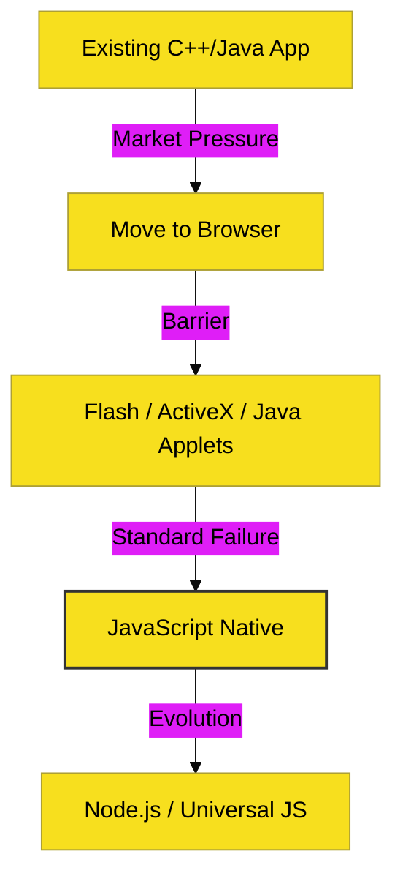

# CH-01: Atwood's Law & Rule of Choice

> **"Any application that can be written in JavaScript, will eventually be written in JavaScript." -- Jeff Atwood (2007)**

---

## 🔗 Source Hub
- **Primary Source**: [Atwood's Blog - The Rule of Least Power](https://blog.codinghorror.com/the-principle-of-least-power/)
- **Cultural Context**: [Jeff Atwood on Wikipedia](https://en.wikipedia.org/wiki/Jeff_Atwood)

---

## 🌓 1. Essence: The Logic
Hukum Atwood bukanlah sekadar jargon, melainkan fenomena ekonomi dan teknis. Karena JavaScript ada di mana-mana (**everywhere**), biaya untuk menulis ulang sebuah sistem ke dalam JavaScript seringkali lebih murah daripada memaksa pengguna memasang runtime baru atau mempelajari bahasa baru.

Prinsip ini berakar dari **Rule of Least Power**: Pilihlah bahasa yang paling simpel dan paling luas dukungannya untuk menyelesaikan masalah, sebelum memilih yang paling kuat namun sempit.

---

## 🎨 2. Visual Logic: The Inevitability
Alur dominasi JavaScript menurut Hukum Atwood:

---

## ⚠️ 3. Common Pitfalls & Myths
- **Mitos**: "JavaScript akan menggantikan semua bahasa lain." (Tidak, bahasa lain tetap ada untuk kasus spesifik, namun JS menjadi lingua franca di lapisan aplikasi).
- **Mitos**: "Hukum Atwood hanya berlaku di web." (Salah, hukum ini kini terbukti di mobile (React Native/Ionic) dan desktop (Electron)).

---
*Back to [Philosophy & Vision](../README.md)*
