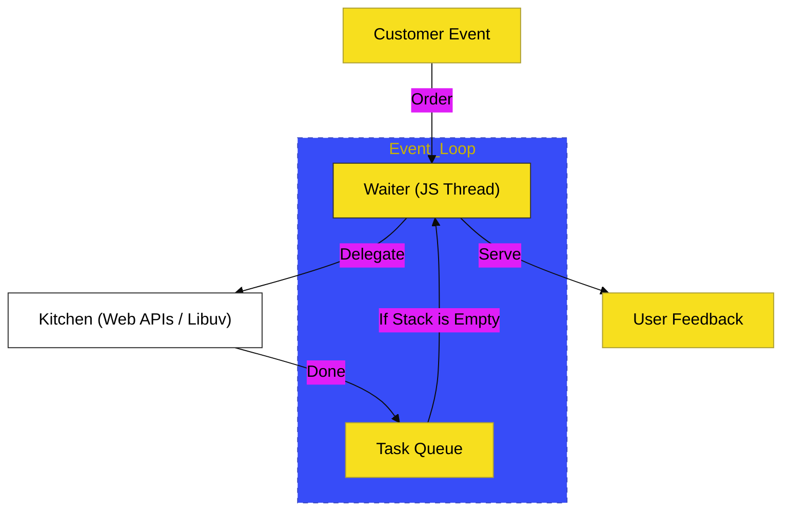

# CH-02: The Kinetic Nature (Event-Driven)

> **"JavaScript is Kinetic. The Heart of Asynchronous Orchestration."**

---

## 🔗 Source Hub
- **Core Concept**: [MDN Web Docs - JavaScript execution model](https://developer.mozilla.org/en-US/docs/Web/JavaScript/Reference/Execution_model)
- **Runtime Perspective**: [Node.js - About the Event Loop](https://nodejs.org/en/docs/guides/event-loop-timers-and-nexttick)
- **Conceptual Parent**: [Pillar Doc: Aesthetics & Tone](../../../docs/standards/aesthetics-and-tone.md)

---

## 🌓 1. Essence: The Logic
JavaScript bersifat **Kinetik** karena ia dirancang untuk bergerak tanpa harus berhenti menunggu proses yang lambat. Kemampuan ini lahir dari kerja sama antara **bahasa JavaScript** (yang bersifat Single-threaded) dan **host environment** (seperti Browser atau Node.js) yang menyediakan mekanisme antrean event.

Inti dari sifat kinetik adalah **Event-Driven Architecture**: JavaScript bereaksi terhadap kejadian (klik, timer, respon network) dengan cara mendelegasikan pekerjaan ke latar belakang, menjaga agar *User Experience* tetap mulus.

---

## 🎨 2. Visual Logic: The Restaurant Analogy
Mekanisme Kinetik:

---

## ⚠️ 3. Common Pitfalls & Myths
- **Mitos**: "JavaScript bisa melakukan banyak hal sekaligus di satu thread." (Tidak, eksekusi kode tetap satu per satu, tapi delegasi API bisa dilakukan di luar thread utama).
- **Mitos**: "Event Loop adalah bagian dari bahasa JavaScript." (Sama sekali bukan, Event Loop adalah mekanisme dari **Runtime**).

---
*Back to [Philosophy & Vision](../README.md)*
