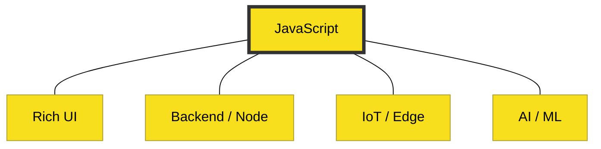

# BK-03: Philosophy & Vision

> **"Segalanyanya Akan Bermuara di JavaScript."**

---

## 🔗 Source Hub
- **Atwood's Blog**: [The Principle of Least Power](https://blog.codinghorror.com/the-principle-of-least-power/)
- **Core Mindset**: [Blueprint: JavaScript Hub](../../../learning-matrix-blueprint/01-Language-Hubs/JavaScript-Knowledge-Base.md)

---

## 🌓 1. Essence: The Narrative
Filosofi JavaScript bukan tentang kekakuan, melainkan tentang **Adopsi Massal** dan **Fleksibilitas**. Visi kinetik memandang JavaScript sebagai "pusat detak jantung" web yang menghubungkan segala sesuatu—dari UI yang responsif hingga komunikasi backend yang asinkron.

Buku ini membedah dua hukum fundamental yang mendasari dominasi JavaScript: **Hukum Atwood** (Apapun yang bisa ditulis dalam JS, akhirnya akan ditulis dalam JS) dan **Sifat Kinetik** (Model eksekusi yang berbasis kejadian/event).

---

## 🗺️ 2. Landscape: The Big Picture
Filosofi ini adalah kompas bagi pengembang senior untuk memahami kapan dan mengapa JavaScript adalah pilihan arsitektur yang tepat.

### 🎨 Visual Logic: The Attraction Hub

### 🏛️ Table of Materials
| Bab | Judul | Status | Visual | Spec-Sync |
| :--- | :--- | :--- | :---: | :--- |
| **CH-01** | [Atwood's Law](./CH-01_AtwoodsLaw/) | [x] Complete | [x] Mermaid | Philosophical |
| **CH-02** | [The Kinetic Nature (Event-Driven)](./CH-02_TheKineticNature/) | [x] Complete | [x] Mermaid | Runtime-Logic |

---

## ⚠️ 3. Common Pitfalls & Myths
- **Mitos**: "JavaScript dipakai hanya karena terpaksa oleh browser." (Faktanya, banyak alternatif seperti Dart/Purescript yang berusaha menggantinya, namun JS tetap menang karena ekosistem & filosofi adopsinya).
- **Mitos**: "Hukum Atwood itu bercanda." (Faktanya, kita kini punya emulator DOS, Photoshop, hingga engine 3D di dalam JS).

---
*Back to [RAK-01-introduction-essence](../README.md)*
