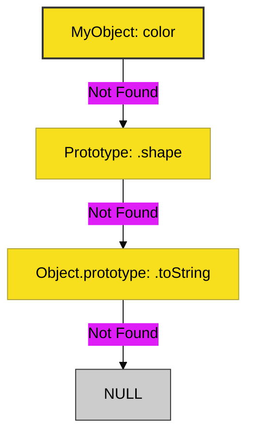

# CH-02: Prototypal Inheritance (Delegation)

> **"Pewarisan Berbasis Hubungan Objek, Bukan Kelas Kaku."**

---

## 🔗 Source Hub
- **TC39 Spec**: [ECMA-262 - Ordinary Object Internal Methods](https://tc39.es/ecma262/#sec-ordinary-object-internal-methods-and-internal-slots)
- **MDN Guide**: [Inheritance & Prototype Chain](https://developer.mozilla.org/en-US/docs/Web/JavaScript/Inheritance_and_the_prototype_chain)

---

## 🌓 1. Essence: The Logic
Berbeda dengan bahasa seperti Java yang menggunakan *Class-based Inheritance*, JavaScript menggunakan **Prototypal Inheritance**. Intinya adalah **Delegasi**. Setiap objek memiliki "tautan internal" ke objek lain (prototipenya). Jika suatu properti tidak ditemukan di objek saat ini, JavaScript akan mencarinya ke atas di dalam **Prototype Chain**.

Mekanisme ini jauh lebih fleksibel karena memungkinkan objek untuk mewarisi perilaku secara dinamis saat runtime tanpa harus dikunci dalam hierarki kelas yang kaku.

---

## 🎨 2. Visual Logic: The Prototype Chain
Alur pencarian properti:

---

## ⚠️ 3. Common Pitfalls & Myths
- **Mitos**: "`class` di ES6 mengubah JavaScript menjadi Class-based." (Tidak, secara teknis `class` hanyalah *Syntax Sugar* di atas Prototype Chain yang tetap berjalan di belakang layar).
- **Mitos**: "Setiap objek memiliki salinan fungsinya sendiri." (Faktanya, fungsi didefinisikan satu kali di prototipe dan dibagikan ke semua objek turunannya, sehingga sangat hemat memori).

---
*Back to [Core Characteristics](../README.md)*
