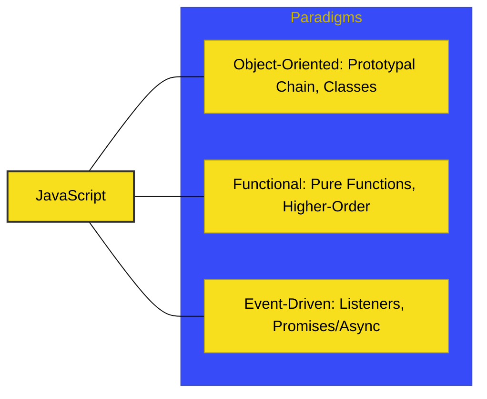

# CH-03: Multi-Paradigm Flexibility

> **"Satu Bahasa, Banyak Gaya: Fungsional, OOP, dan Event-Driven."**

---

## 🔗 Source Hub
- **MDN Guide**: [Principles of Functional Programming](https://developer.mozilla.org/en-US/docs/Glossary/Functional_programming)
- **Technical Reference**: [JavaScript MDN - Classes](https://developer.mozilla.org/en-US/docs/Web/JavaScript/Reference/Classes)

---

## 🌓 1. Essence: The Logic
JavaScript adalah bahasa yang tidak memaksa pengembangnya untuk mengikuti satu gaya koding tertentu. Ia mendukung gaya **Imperative** (langkah-langkah instruksi), **Object-Oriented** (berbasis objek/prototipe), dan yang paling populer saat ini: **Functional Programming** (fungsi murni, map/filter/reduce).

Fleksibilitas ini menjadikannya bahasa yang ideal untuk berbagai tingkat sistem—dari manipulasi UI yang sederhana hingga orkestrasi data backend yang kompleks secara asinkron.

---

## 🎨 2. Visual Logic: Paradigm Hub
Tiga pilar gaya koding di JavaScript:

---

## ⚠️ 3. Common Pitfalls & Myths
- **Mitos**: "JavaScript hanyalah bahasa untuk fungsi anonim sederhana." (Sama sekali tidak, JS kini memiliki sintaks `class` dan *Private Methods* yang sangat matang untuk koding OOP skala besar).
- **Mitos**: "Gaya Functional di JavaScript lambat." (Berkat optimasi di JIT Compiler modern, operasi fungsional praktis setara kecepatannya dengan loop imperative tradisional).

---
*Back to [Core Characteristics](../README.md)*
