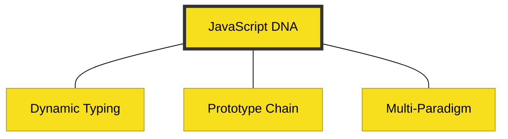

# BK-04: Core Characteristics

> **"Membedah DNA: Fleksibilitas, Delegasi, dan Multi-paradigma."**

---

## 🔗 Source Hub
- **TC39 Spec**: [ECMA-262 Data Types & Values](https://tc39.es/ecma262/#sec-ecmascript-data-types-and-values)
- **MDN Glossary**: [Inheritance & Prototype Chain](https://developer.mozilla.org/en-US/docs/Web/JavaScript/Inheritance_and_the_prototype_chain)
- **Conceptual Parent**: [Pillar Doc: Aesthetics & Tone](../../../docs/standards/aesthetics-and-tone.md)

---

## 🌓 1. Essence: The Narrative
JavaScript memiliki karakter teknis yang sangat unik—seringkali disalahpahami oleh mereka yang datang dari latar belakang bahasa kaku (C#/Java). Karakteristik intinya adalah **Fleksibilitas Tanpa Batas**.

Buku ini membedah tiga DNA utama JavaScript: **Dynamic Typing** (kemampuan berubah tipe), **Prototypal Inheritance** (sistem pewarisan berbasis objek, bukan kelas kaku), dan sifatnya yang **Multi-paradigma** (bisa fungsional, berorientasi objek, atau berbasis kejadian/event).

---

## 🗺️ 2. Landscape: The Big Picture
Memahami karakteristik ini adalah kunci untuk menguasai "Sihir" JavaScript tanpa takut terjebak dalam perilaku yang tak terduga (*unexpected behavior*).

### 🎨 Visual Logic: The DNA Triple-Helix

### 🏛️ Table of Materials
| Bab | Judul | Status | Visual | Spec-Sync |
| :--- | :--- | :--- | :---: | :--- |
| **CH-01** | [Dynamic Nature (Typing)](./CH-01_DynamicNature/) | [x] Complete | [x] Mermaid | Spec-Rigor |
| **CH-02** | [Prototypal Inheritance](./CH-02_PrototypalInheritance/) | [x] Complete | [x] Mermaid | Spec-Rigor |
| **CH-03** | [Multi-Paradigm Flexibility](./CH-03_MultiParadigm/) | [x] Complete | [x] Mermaid | Design-Logic |

---

## ⚠️ 3. Common Pitfalls & Myths
- **Mitos**: "Prototypal Inheritance hanyalah versi buruk dari Class-based OOP." (Sama sekali tidak, sistem Prototype justru jauh lebih fleksibel dan hemat memori jika dipahami dengan benar).
- **Mitos**: "Dynamic Typing membuat JS tidak aman." (Fleksibilitas adalah kekuatan; ketelanjangan tipe diatasi dengan praktik koding yang disiplin atau **TypeScript**).

---
*Back to [RAK-01-introduction-essence](../README.md)*
