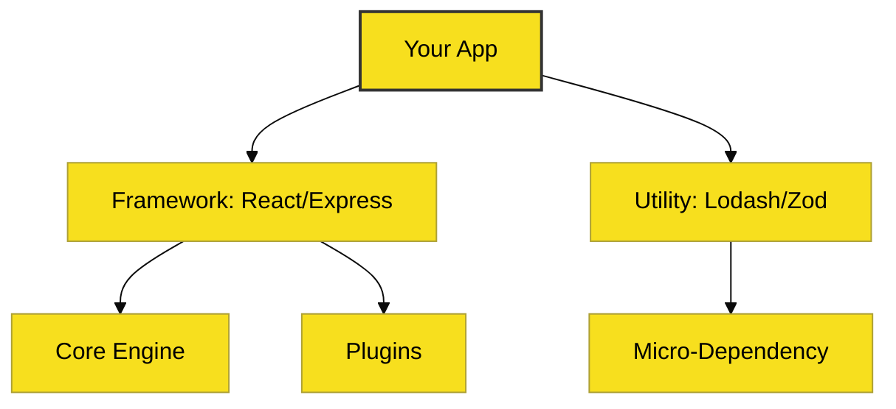

# CH-01: Ecosystem Analysis (The npm Power)

> **"Membangun dengan Komponen, Bukan dari Nol."**

---

## 🔗 Source Hub
- **npm Docs**: [About npm](https://docs.npmjs.com/about-npm)
- **Technical Reference**: [Node.js - About](https://nodejs.org/en/about)

---

## 🌓 1. Essence: The Logic
Kekuatan sejati JavaScript bukan hanya pada bahasanya, melainkan pada **Lautan Modul** yang tersedia di **npm**. Budaya berbagi paket mikro (*micro-modules*) memungkinkan pengembang untuk mempercepat pembangunan aplikasi secara dramatis.

Namun, ketergantungan ini menciptakan tantangan baru: **Dependency Management**. Setiap paket yang Anda pasang mungkin memiliki puluhan dependensi lain di belakangnya, menciptakan "pohon" yang sangat besar yang harus diaudit secara berkala.

---

## 🎨 2. Visual Logic: The Dependency Tree
Struktur paket di dalam proyek:

---

## ⚠️ 3. Common Pitfalls & Myths
- **Mitos**: "Semua paket di npm aman." (Sama sekali tidak, audit keamanan rutin sangat wajib dilakukan).
- **Mitos**: "Semakin besar `node_modules`, semakin lambat aplikasinya." (Belum tentu saat runtime karena proses *bundling*, namun pasti memperlambat waktu install & CI/CD).

---
*Back to [Pros & Cons](../README.md)*
