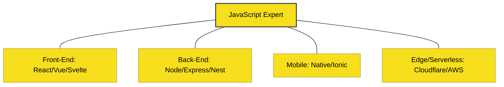

# CH-02: Industry Realities (Careers)

> **"Bahasa yang Menguasai Segala Lapisan Karir."**

---

## 🔗 Source Hub
- **Career Map**: [Stack Overflow Developer Survey](https://survey.stackoverflow.co/)
- **Technical Reference**: [State of JS - Job Satisfaction](https://2023.stateofjs.com/en-US/resources/usage/)

---

## 🌓 1. Essence: The Logic
Belajar JavaScript hari ini bukan hanya tentang memanipulasi tombol di website. Realitas industri menunjukkan bahwa **JavaScript adalah bahasa universal**. Ia menguasai tumpukan **Full-stack**, **Mobile Native** (React Native), dan bahkan kini merambah ke sistem **Serverless** dan **Edge Functions** yang sangat efisien.

Peluang karir bagi pengembang senior JavaScript mencakup pembangunan arsitektur mikro, performa tinggi di backend (Node.js/Bun), hingga orkestrasi aplikasi mobile skala besar.

---

## 🎨 2. Visual Logic: The Career Landscape
Distribusi peran pengembang JavaScript:

---

## ⚠️ 3. Common Pitfalls & Myths
- **Mitos**: "Pengembang JavaScript hanya bisa bekerja di Front-end." (Sama sekali tidak, gaji posisi Back-end Node.js di tingkat senior sangat kompetitif).
- **Mitos**: "JavaScript terlalu mudah untuk karir serius." (Sama sekali tidak, menguasai manajemen memori dan performa asinkron di JS adalah tantangan tingkat tinggi).

---
*Back to [Pros & Cons](../README.md)*
