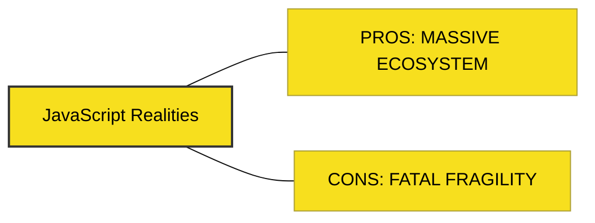

# BK-05: Pros & Cons (Realitas Industri)

> **"Antara Lautan Modul dan Kekacauan Dependensi."**

---

## 🔗 Source Hub
- **npm Ecosystem**: [npm Docs - About npm](https://docs.npmjs.com/about-npm)
- **State of JS**: [State of JS Survey Report](https://2023.stateofjs.com/)
- **Technical Reference**: [Node.js - Security Best Practices](https://nodejs.org/en/docs/guides/security-best-practices)

---

## 🌓 1. Essence: The Narrative
JavaScript adalah bahasa dengan ekosistem terbuka terbesar di dunia. Kekuatan utamanya adalah **Kecepatan Distribusi Solusi**—kita jarang sekali harus membangun sesuatu benar-benar dari nol berkat jutaan paket di **npm**. Namun, kebebasan ini datang dengan harga: tumpukan dependensi yang bisa menjadi rapuh (*fragile*) jika tidak dikelola dengan bijak.

Buku ini membedah realitas industri JavaScript—dari kekuatan ekosistem yang masif hingga tantangan keamanan dan kompleksitas maintainability yang dihadapi oleh pengembang senior.

---

## 🗺️ 2. Landscape: The Big Picture
Memahami pro dan kontra ini membantu pengembang dalam mengambil keputusan arsitektur yang seimbang (**Trade-offs Analysis**).

### 🎨 Visual Logic: The Ecosystem Balance

### 🏛️ Table of Materials
| Bab | Judul | Status | Visual | Spec-Sync |
| :--- | :--- | :--- | :---: | :--- |
| **CH-01** | [Ecosystem Analysis (npm)](./CH-01_EcosystemAnalysis/) | [x] Complete | [x] Mermaid | Industry-Logic |
| **CH-02** | [Industry Realities (Careers)](./CH-02_IndustryRealities/) | [x] Complete | [x] Mermaid | Career-Map |

---

## ⚠️ 3. Common Pitfalls & Myths
- **Mitos**: "Semakin banyak library, semakin produktif." (Faktanya, terlalu banyak dependensi bisa memperlambat performa dan mempersulit pembaruan keamanan).
- **Mitos**: "JavaScript hanya untuk koding iseng." (Faktanya, JS kini memacu ekosistem cloud, edge computing, dan AI secara masif).

---
*Back to [RAK-01-introduction-essence](../README.md)*
