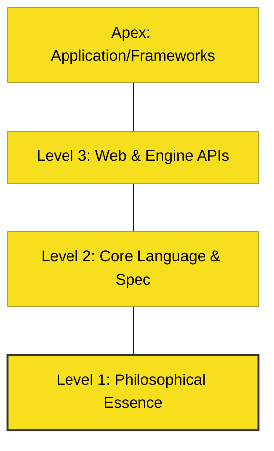

# CH-01: How to Learn JavaScript Effectively

> **"Kuasai Logika, Baru Sintaks. Kuasai Engine, Baru Spesifikasi."**

---

## 🔗 Source Hub
- **Learning Principles**: [Pillar Doc: Content Workflow](../../../docs/standards/content-workflow.md)
- **Conceptual Parent**: [RAK-01 Essence](../README.md)

---

## 🌓 1. Essence: The Logic
Belajar JavaScript seringkali membingungkan karena banyaknya framework dan library baru setiap harinya. Strategi belajar yang efektif adalah dengan **Mendekonstruksi Dasar-dasarnya**. Jangan hanya menghafal sintaks `if/else`, melainkan pahami bagaimana **Execution Context** bekerja di belakang layar.

Metode kami adalah **Intuisi Kinetik**: Kami menggunakan analogi dunia nyata untuk membangun model mental sebelum Anda melihat baris kode yang sebenarnya.

---

## 🎨 2. Visual Logic: The Learning Pyramid
Struktur kedalaman pemahaman:

---

## ⚠️ 3. Common Pitfalls & Myths
- **Mitos**: "Saya harus belajar framework (React/Vue) dulu agar bisa cari kerja." (Faktanya, tanpa dasar JavaScript yang kuat, Anda akan kesulitan saat menghadapi bug arsitektural yang kompleks).
- **Mitos**: "Belajar spesifikasi ECMA membosankan." (Faktanya, memahami spesifikasi adalah satu-satunya cara untuk menjadi pengembang senior tingkat mahir).

---
*Back to [Library Orientation](../README.md)*
