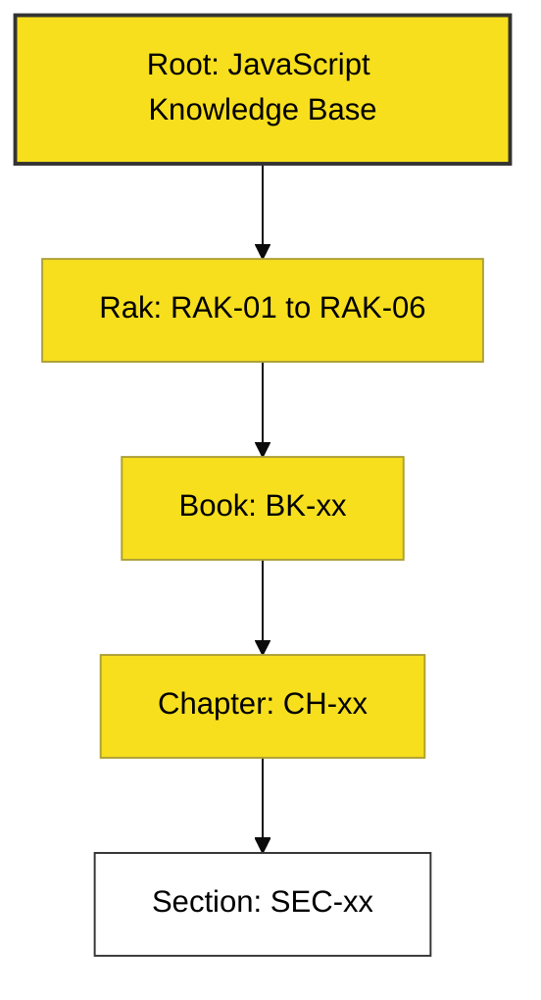

# CH-02: Library Navigation Portals

> **"Gunakan Jenjang 6-Level: Dari Portal ke Unit Terkecil."**

---

## 🔗 Source Hub
- **Standard**: [Repo Standards - Hierarchy & Conventions](../../../docs/standards/repository-standards.md)
- **Conceptual Parent**: [RAK-01 Essence](../README.md)

---

## 🌓 1. Essence: The Logic
Menavigasi dalam ribuan unit materi di dalam repositori ini bisa membingungkan jika Anda tidak memiliki struktur berpikir yang benar. Gunakan **Hierarchy 6-Level** sebagai kompas navigasi:

1. **Root**: Gerbang Utama.
2. **Rak**: Domain Besar (ES-DNA).
3. **Sub-Rak**: Track Spesifik.
4. **Buku**: Koleksi Materi Terintegrasi.
5. **Bab**: Unit Koding Teknis.
6. **Section**: Detail Kedalaman Mesin.

---

## 🎨 2. Visual Logic: The Hierarchy Tree
Struktur Navigasi:

---

## ⚠️ 3. Common Pitfalls & Myths
- **Mitos**: "Setiap file README isinya sama." (Sama sekali tidak, setiap file memiliki **Visual Logic** unik yang dibangun untuk bagian materi tersebut saja).
- **Mitos**: "Nama folder adalah hal yang paling penting." (Faktanya, tautan antar file melalui **Source Hub** dan **Landscape** jauh lebih penting untuk kemudahan navigasi).

---
*Back to [Library Orientation](../README.md)*
