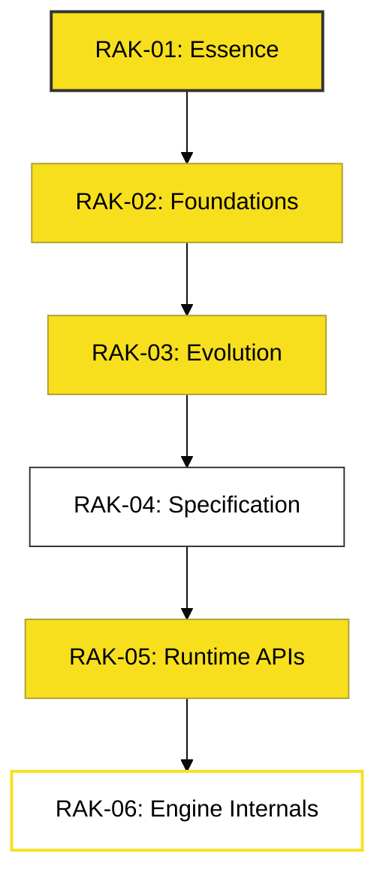

# BK-06: Library Orientation

> **"Peta Jalan Menuju Penguasaan JavaScript Secara Radikal."**

---

## 🔗 Source Hub
- **Repository Standards**: [Docs: Hierarchy & Conventions](../../../docs/standards/repository-standards.md)
- **Workflow Guide**: [Docs: Content & Research](../../../docs/standards/content-workflow.md)

---

## 🌓 1. Essence: The Narrative
Selamat datang di titik akhir dari pengenalan esensial ini. **BK-06** dirancang untuk membekali Anda dengan kompas navigasi sebelum Anda berkelana jauh ke dalam rak-rak teknis lainnya. Di sini, kita mendefinisikan bagaimana cara menggunakan "Perpustakaan" ini secara efektif agar Anda tidak hanya mengerti cara koding, tapi mengerti **Arsitektur Pemikiran JavaScript**.

Sesuai dengan **Hukum Atwood**, penguasaan JavaScript adalah investasi seumur hidup yang akan terus memberikan imbal hasil di berbagai platform.

---

## 🗺️ 2. Landscape: The Path Ahead
Berikut adalah simulasi alur belajar Anda di seluruh ekosistem :

### 🎨 Visual Logic: The Education Path

### 🏛️ Table of Materials
| Bab | Judul | Status | Visual | Path |
| :--- | :--- | :--- | :---: | :--- |
| **CH-01** | [How to Learn Effectively](./CH-01_HowToLearn/) | [x] Complete | [x] Mermaid | Mindset |
| **CH-02** | [Library Navigation Portals](./CH-02_LibraryNavigation/) | [x] Complete | [x] Mermaid | Map |

---

## ⚠️ 3. Common Pitfalls & Myths
- **Mitos**: "Saya harus belajar urut bab demi bab." (Faktanya, Anda bisa melakukan penjelajahan acak, namun **RAK-01** dan **RAK-02** adalah prasyarat mutlak sebelum menyentuh **RAK-04** dan **RAK-06**).
- **Mitos**: "Dokumentasi ini membosankan." (Faktanya, kami merancangnya dengan pendekatan **Kinetik** agar setiap materi terasa seperti petualangan arsitektural).

---
*Back to [RAK-01-introduction-essence](../README.md)*
