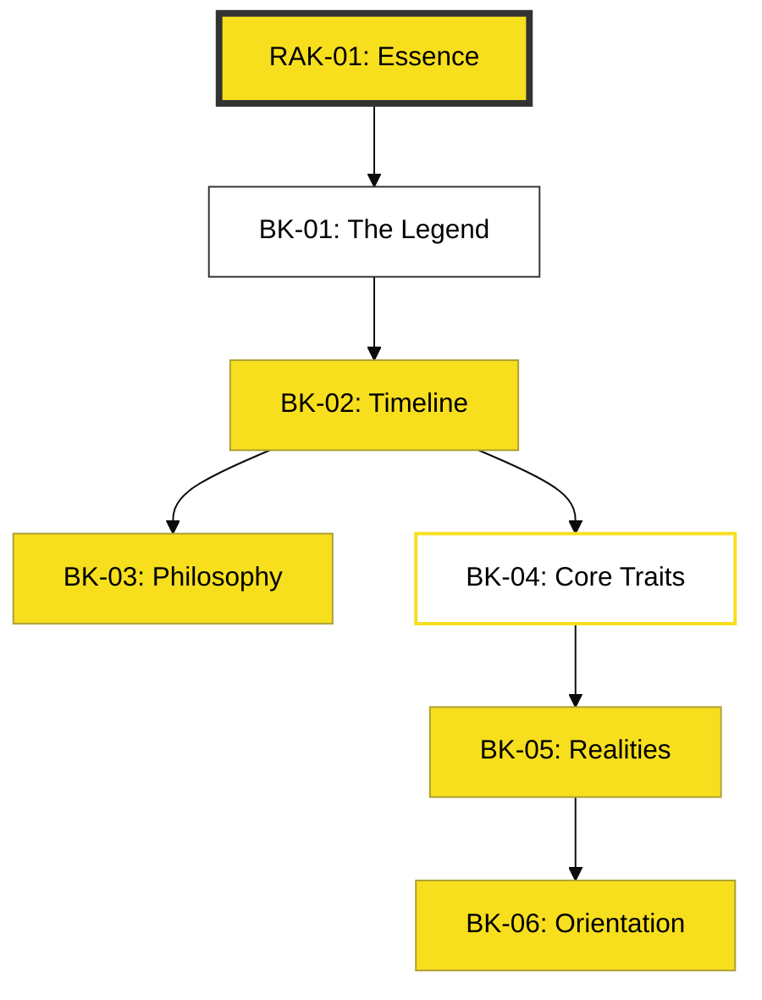

# RAK-01: Introduction & Essence

> **"Where the story of JavaScript begins. From a 10-day legend to the global kinetic hub."**

---

## 🔗 Source Hub
- **Primary History**: [Brendan Eich's Official Blog](https://brendaneich.com/)
- **Documentation**: [MDN: A Brief History of JavaScript](https://developer.mozilla.org/en-US/docs/Web/JavaScript/About_JavaScript)
- **Strategic Parent**: [Blueprint: JavaScript Knowledge Base](../../../learning-matrix-blueprint/01-Language-Hubs/JavaScript-Knowledge-Base.md)

---

## 🌓 1. Essence: The Narrative
JavaScript diciptakan bukan sebagai bahasa sistem yang kaku, melainkan sebagai "bahasa perekat" (glue language) yang lentur. Esensi RAK-01 adalah memahami bagaimana fleksibilitas ekstrim ini—yang awalnya dianggap remeh—justru menjadi alasan utama mengapa JavaScript kini mendominasi hampir setiap lingkungan koding.

Karakteristik uniknya sebagai bahasa **Multi-runtime** berarti JavaScript kini tidak lagi hanya hidup di browser, melainkan di server (Node/Bun/Deno), peranti IoT, hingga sistem cloud-native (Edge).

---

---

## 🗺️ 2. Landscape: The Big Picture
RAK-01 bertindak sebagai **Laboratorium Intuisi**. Sebelum Anda membedah sintaks di RAK-02 atau dekonstruksi spesifikasi di RAK-04, Anda wajib memahami "jiwa" bahasa ini di RAK-01 agar tidak tersesat dalam kompleksitas teknis nantinya.

### 🎨 Visual Logic: RAK Map

### 🏛️ Library Atlas
1. **[BK-01_TheTenDayLegend](./BK-01_TheTenDayLegend/)**: Misi Netscape dan kelahiran JavaScript.
2. **[BK-02_EvolutionaryTimeline](./BK-02_EvolutionaryTimeline/)**: Perang Browser hingga Era Modern.
3. **[BK-03_PhilosophyVision](./BK-03_PhilosophyVision/)**: Hukum Atwood dan Visi Kinetik.
4. **[BK-04_CoreCharacteristics](./BK-04_CoreCharacteristics/)**: Sifat Dynamic, Prototype, dan Multi-paradigma.
5. **[BK-05_ProsCons](./BK-05_ProsCons/)**: Analisa Ekosistem & Realitas Industri.
6. **[BK-06_LibraryOrientation](./BK-06_LibraryOrientation/)**: Panduan Belajar di Perpustakaan ini.

---

## ⚠️ 3. Common Pitfalls & Myths
- **Mitos**: "JavaScript adalah versi ringan dari Java." (Salah total, secara filosofis sangat berbeda).
- **Mitos**: "JavaScript hanya untuk membuat animasi salju di website." (Faktanya kini menggerakkan backend enterprise).
- **Mitos**: "JS diciptakan terburu-buru sehingga cacat." (Meskipun cepat, banyak keputusan desain awal yang sangat visioner).

---
*Status: [/] Partial. Materi sedang diselaraskan dengan Adaptive Gold Standard.*
