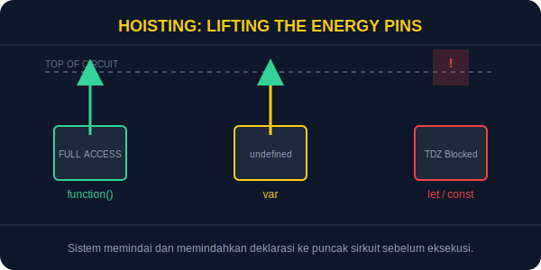

# SEC-01: Hoisting (Lifting the Energy Pins)

> **"Hoisting adalah mekanisme persiapan di mana JavaScript menyiapkan deklarasi variabel dan fungsi sebelum arus eksekusi mulai berjalan."**

Pernahkah Anda bertanya-tanya mengapa sebuah fungsi bisa dipanggil bahkan sebelum baris definisinya muncul? Itulah efek dari **hoisting**.

## Source Hub
- **Primary Source**: [MDN Web Docs - Hoisting](https://developer.mozilla.org/en-US/docs/Glossary/Hoisting)
- **Technical Reference**: [ECMA-262 - Variable Environment](https://tc39.es/ecma262/#sec-variable-environment)

## Senior Terminology
- **Temporal Dead Zone (TDZ)**: Area di mana variabel `let` dan `const` sudah tercatat tetapi belum boleh diakses.
- **Creation vs Execution Phase**: Tahap persiapan memori dan tahap menjalankan kode.
- **Function Declaration vs Expression**: Perbedaan bentuk fungsi yang membuat perilaku hoisting-nya tidak sama.

## 1. Mental Model: "Lifting the Energy Pins"

Bayangkan Hub Energi memiliki papan sirkuit otomatis. Sebelum sistem dinyalakan, mesin akan memindai seluruh papan dan menyiapkan pin koneksi untuk deklarasi yang ditemukan.

- **Creation Phase**: Sistem melihat ada variabel atau fungsi lalu memesan tempat di memori.
- **Execution Phase**: Arus mulai mengalir baris demi baris dan nilai nyata mulai diisikan.



---

## 2. Hoisting pada Fungsi

Fungsi yang dideklarasikan dengan kata kunci `function` diangkat sepenuhnya.

```javascript
activateCore();

function activateCore() {
    console.log("Web Energy Hub is ONLINE.");
}
```

Analogi: pin fungsi sudah terpasang lengkap sebelum arus utama dinyalakan.

---

## 3. Hoisting pada Variabel

Perbedaan penting muncul saat membandingkan `var` dengan `let` dan `const`.

### A. `var`
`var` dicatat dan langsung diberi nilai awal `undefined`.

```javascript
console.log(powerLevel); // undefined
var powerLevel = 100;
```

### B. `let` dan `const`
Keduanya juga dipersiapkan, tetapi belum diinisialisasi. Karena itu akses terlalu dini akan memicu error TDZ.

```javascript
console.log(currentTemp); // ReferenceError
let currentTemp = 25;
```

---

## Arsitek Mindset: Hindari Efek Magis

Walau hoisting selalu terjadi, lebih aman menulis deklarasi sebelum pemakaiannya. Ini mengurangi perilaku yang terasa "ajaib" dan membuat alur kode lebih mudah dibaca.

---

## Hands-on: Eksperimen Pin Sirkuit

Buka file `examples/hoisting_lab.js` untuk melihat perbedaan fungsi, `var`, dan `let` ketika dipanggil sebelum waktunya.

---
*Status: [status.md](../../../status.md)*

---
*Back to [Advanced Flow & Scope](../README.md)*
