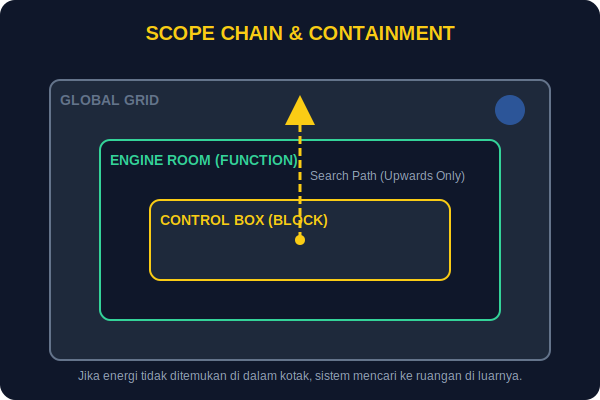

# SEC-02: Scope Chain & Lexical Environment

> **"Scope chain adalah jalur pencarian variabel. Jika nilai tidak ditemukan di ruang terdekat, JavaScript akan mencari ke lingkup luar sampai mencapai global scope."**

Setelah memahami hoisting, kita perlu memahami di mana sebuah variabel hidup dan siapa yang boleh mengaksesnya.

## Source Hub
- **Primary Source**: [MDN Web Docs - Scope](https://developer.mozilla.org/en-US/docs/Glossary/Scope)
- **Technical Reference**: [ECMA-262 - Lexical Environments](https://tc39.es/ecma262/#sec-lexical-environments)

## Senior Terminology
- **Lexical Scope**: Akses variabel ditentukan oleh lokasi penulisan kode, bukan lokasi pemanggilan.
- **Scope Chain**: Jalur pencarian ke parent scope ketika nama tidak ditemukan di scope lokal.
- **Variable Shadowing**: Variabel lokal menutupi variabel luar yang bernama sama.

## 1. Mental Model: "Energy Containment Units"

Bayangkan Hub Energi memiliki beberapa lapisan ruangan:
1. **Global Scope**: area bersama yang paling luar.
2. **Function Scope**: ruang yang dimiliki fungsi.
3. **Block Scope**: ruang kecil di dalam `{}` seperti `if` atau `for`.

---

## 2. Lexical Environment

Setiap fungsi membawa "peta ruangan" tempat ia dibuat. Inilah yang membuat JavaScript bersifat lexical: hubungan akses ditentukan sejak kode ditulis.

---

## 3. Scope Chain

Jika sebuah nama tidak ada di lingkup terdalam, pencarian bergerak ke luar.

```javascript
const mainPower = "1000MW";

function engineRoom() {
    const localGenerator = "50MW";

    function controlBox() {
        const switchID = "CB-01";

        console.log(switchID);
        console.log(localGenerator);
        console.log(mainPower);
    }

    controlBox();
}

engineRoom();
```

**Aturan emas**: pencarian bergerak ke luar, tidak pernah ke dalam.



---

## 4. Shadowing

Jika variabel baru memakai nama yang sama di lingkup yang lebih dalam, variabel luar menjadi tertutupi untuk area tersebut.

---

## Arsitek Mindset: Enkapsulasi dengan Scope

Gunakan `let` dan `const` untuk memanfaatkan block scope. Semakin kecil ruang hidup sebuah variabel, semakin kecil peluang ia bocor ke area yang tidak semestinya.

---

## Hands-on: Penjelajahan Lab Berlapis

Lihat file `examples/scope_lab.js` untuk melihat bagaimana fungsi bersarang mencari variabel di sepanjang scope chain.

---
*Status: [status.md](../../../status.md)*

---
*Back to [Advanced Flow & Scope](../README.md)*
