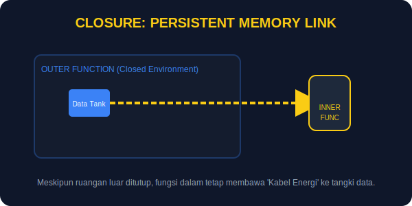

# SEC-03: Closures (Energy Persistent Memory)

> **"Closure adalah kemampuan fungsi untuk tetap mengingat variabel dari scope tempat ia dibuat, bahkan setelah scope luar selesai dieksekusi."**

Closure sering terasa menakutkan di awal, padahal ia hanya memperlihatkan bahwa fungsi JavaScript dapat membawa memori dari tempat kelahirannya.

## Source Hub
- **Primary Source**: [MDN Web Docs - Closures](https://developer.mozilla.org/en-US/docs/Web/JavaScript/Closures)
- **Technical Reference**: [ECMA-262 - Environment Records](https://tc39.es/ecma262/#sec-environment-records)

## Senior Terminology
- **Persistent Lexical Scope**: Akses yang tetap hidup ke scope asal fungsi.
- **Encapsulation**: Menyembunyikan data agar hanya dapat diubah lewat jalur yang disediakan.
- **Static Binding**: Hubungan scope ditentukan saat penulisan kode.

## 1. Mental Model: "The Persistent Battery Pack"

Bayangkan Anda mengisi baterai di ruang mesin lalu membawanya keluar. Walau Anda sudah meninggalkan ruang itu, baterai masih membawa energi dari sana.

- **Fungsi luar**: tempat energi disiapkan.
- **Fungsi dalam**: unit yang dibawa keluar.
- **Closure**: koneksi yang membuat fungsi dalam tetap bisa mengakses variabel dari luar.



---

## 2. Bagaimana Closure Terbentuk

Closure terbentuk saat sebuah fungsi dalam mengakses variabel dari fungsi luar.

```javascript
function createPowerVault() {
    let energyStored = 0;

    return function(amount) {
        energyStored += amount;
        return `Vault Level: ${energyStored}MW`;
    };
}

const myVault = createPowerVault();

console.log(myVault(100));
console.log(myVault(50));
```

Meski `createPowerVault()` selesai dijalankan, fungsi yang dikembalikan masih bisa memakai `energyStored`.

---

## 3. Kegunaan Utama: Privasi Data

Closure sering dipakai untuk menjaga data tetap privat. Variabel tetap hidup, tetapi tidak bisa disentuh langsung dari luar.

---

## Arsitek Mindset: Kuat, tapi Jangan Menimbun

Closure bagus untuk enkapsulasi, tetapi hati-hati menahan terlalu banyak data di dalamnya. Referensi yang terus hidup bisa membuat memori bertahan lebih lama dari yang dibutuhkan.

---

## Hands-on: Brankas Energi Terkunci

Buka file `examples/closure_lab.js` untuk melihat bagaimana closure dipakai untuk membuat ID unik yang tidak bisa dimanipulasi langsung.

---
*Status: [status.md](../../../status.md)*

---
*Back to [Advanced Flow & Scope](../README.md)*
