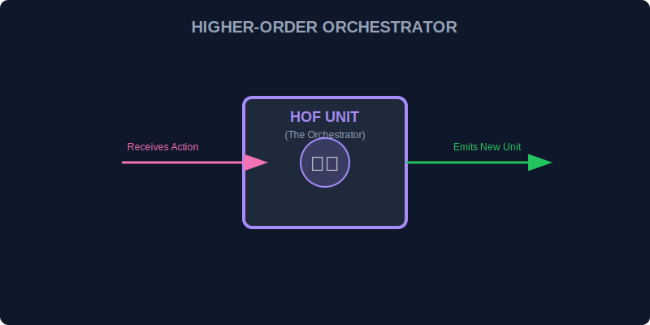

# SEC-04: Higher-order Functions (Energy Orchestrators)

> **"Higher-order function adalah fungsi yang menerima fungsi lain, mengembalikan fungsi lain, atau keduanya."**

Jika fungsi biasa adalah pekerja, maka higher-order function adalah pengatur kerja yang mengoordinasikan unit-unit fungsi lain.

## Source Hub
- **Primary Source**: [MDN Web Docs - First-class Function](https://developer.mozilla.org/en-US/docs/Glossary/First-class_Function)
- **Practical Guide**: [MDN Web Docs - Functions](https://developer.mozilla.org/en-US/docs/Web/JavaScript/Guide/Functions)

## Senior Terminology
- **Abstraction Layer**: Menyembunyikan detail rumit di balik antarmuka yang lebih sederhana.
- **Declarative vs Imperative**: Menyatakan apa yang diinginkan vs menjelaskan langkah demi langkah.
- **Function Composition**: Menggabungkan fungsi kecil menjadi alur kerja yang lebih besar.

## 1. Mental Model: "Energy Orchestrators"

Higher-order function bekerja seperti ban berjalan umum yang bisa diberi pekerja berbeda sesuai kebutuhan.

Suatu fungsi disebut higher-order jika:
1. menerima fungsi lain sebagai argumen, atau
2. mengembalikan fungsi sebagai hasil.



---

## 2. Abstraksi Pengulangan

```javascript
const powerGrids = [100, 200, 300];

const boostedGridsHOF = powerGrids.map(grid => grid * 1.5);
```

HOF membantu kita menulis maksud kerja tanpa harus selalu mengelola loop manual.

---

## 3. Komposisi Fungsi

```javascript
function withEnergyFilter(fn) {
    return function(input) {
        if (input < 0) return "Error: Arus Negatif";
        return fn(input);
    };
}
```

Fungsi kecil bisa dirakit menjadi unit yang lebih kuat dan reusable.

---

## Arsitek Mindset: Pisahkan Orkestrasi dari Eksekusi

Saat logika pengaturan dipisah dari logika kerja inti, kode menjadi lebih fleksibel, lebih mudah diuji, dan lebih mudah diganti komponennya.

---

## Hands-on: Orkestrasi Grid Otomatis

Buka file `examples/hof_lab.js` untuk melihat penyaringan dan transformasi energi dengan pola higher-order function.

---
*Status: [status.md](../../../status.md)*

---
*Back to [The Functional Engine](../README.md)*
