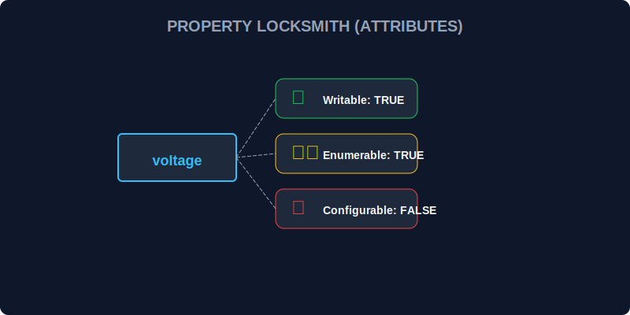

# SEC-03: Object Property Attributes (Energy Locksmiths)

> **"Setiap properti objek tidak hanya memiliki nilai, tetapi juga aturan tersembunyi yang mengontrol apakah ia bisa diubah, dilihat saat iterasi, atau dihapus."**

Property attributes membantu kita menjaga integritas data di dalam objek.

## Source Hub
- **Primary Source**: [MDN Web Docs - Object.defineProperty()](https://developer.mozilla.org/en-US/docs/Web/JavaScript/Reference/Global_Objects/Object/defineProperty)
- **Technical Reference**: [ECMA-262 - Property Descriptor](https://tc39.es/ecma262/#sec-property-descriptor-specification-type)

## Senior Terminology
- **Data vs Accessor Descriptor**: Properti yang menyimpan nilai langsung vs properti dengan `get` dan `set`.
- **Enumerable Attribute**: Menentukan apakah properti muncul dalam iterasi.
- **Object.freeze() / Immutability**: Penguncian objek agar tidak berubah lagi.

## 1. Mental Model: "The Energy Locksmiths"

Bayangkan setiap properti memiliki sistem kunci sendiri: ada yang boleh diubah, ada yang hanya bisa dibaca, dan ada yang tidak boleh dihapus.



---

## 2. Mengenal Property Descriptors

Empat atribut utama untuk data descriptor:
1. `value`
2. `writable`
3. `enumerable`
4. `configurable`

```javascript
const transformer = {};
Object.defineProperty(transformer, 'id', {
    value: 'TR-99',
    writable: false,
    enumerable: true,
    configurable: false
});
```

---

## 3. Penguncian Tingkat Objek

- `Object.preventExtensions(obj)`
- `Object.seal(obj)`
- `Object.freeze(obj)`

Masing-masing memberi tingkat pembatasan yang berbeda.

---

## Arsitek Mindset: Lindungi Data Penting

Gunakan descriptor atau `Object.freeze()` untuk data konfigurasi, metadata sensitif, atau objek yang seharusnya tidak berubah setelah dibuat.

---

## Hands-on: Lab Penguncian Properti

Buka file `examples/props_lab.js` untuk melihat apa yang terjadi saat properti atau objek dikunci.

---
*Status: [status.md](../../../status.md)*

---
*Back to [Object Mastery](../README.md)*
