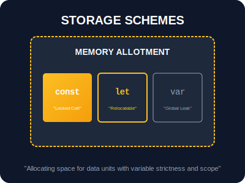

# SR-05: Statements & Declarations (Logic Infrastructure)

> **"Jika Hub adalah sirkuit raksasa, maka Statements adalah rute aliran energi dan Declarations adalah alokasi unit penyimpanan. SR-05 membangun infrastruktur dasar yang memastikan Hub berjalan dengan cerdas, aman, dan efisien."**

**Statements** (Pernyataan) adalah instruksi yang melakukan aksi, sementara **Declarations** (Deklarasi) adalah cara kita memesan ruang penyimpanan di dalam memori Hub.

---

## 🧭 Arsitektur Infrastruktur

### 1. [BK-01: Logic Infrastructure](./BK-01_LogicInfrastructure/README.md)
Membangun pusat kendali alur eksekusi.
- **Control Flow**: `if...else`, `switch`.
- **Iteration**: `for`, `while`, `do...while`.
- **Safety protocols**: `try...catch...finally`.

### 2. [BK-02: Storage Schemes](./BK-02_StorageSchemes/README.md)
Mengatur pendaftaran nama dan alokasi memori.
- **Variable Scoping**: `var`, `let`, `const`.
- **Hoisting**: Bagaimana Hub mendeteksi sirkuit sebelum diaktifkan.

---

## 1. Mental Model: "Logic Infrastructure"

Bayangkan Hub sebagai sebuah gedung pintar:
- **Declarations**: Memasang label pada kotak penyimpanan dan memesan ruang di gudang memori.
- **Statements**: Membuka pintu tertentu, memutar saklar, atau mengulang proses pengisian daya.

---

## Arsitek Mindset: Struktur Tanpa Celah

Sebagai arsitek Hub:
- **Prefer `const` over `let`**: Selalu berikan perlindungan maksimal pada data dengan menguncinya (`const`). Hanya gunakan `let` jika data tersebut memang harus berubah di tengah jalan.
- **Block Scoping**: Gunakan `let` dan `const` untuk menjaga agar variabel tidak "bocor" (leaking) keluar dari sirkuit lokalnya.
- **Graceful Failure**: Selalu gunakan `try...catch` di gerbang masuk energi eksternal (seperti API) agar jika terjadi kegagalan, Hub Anda tidak mengalami mati total.

---

## Hands-on: Lab Infrastruktur
Pelajari teknik pengulangan dan alokasi penyimpanan yang aman di folder `examples/`.

---
*Status: Gold Standard (100% Complete)*
