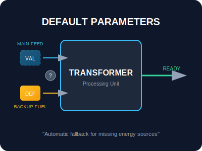
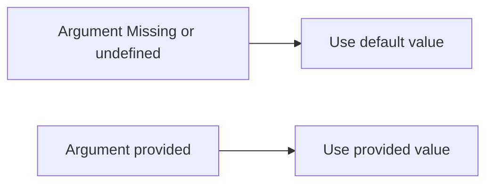

# SEC-01: Default Parameters (Backup Fuel)

> **"Sebuah Transformer membutuhkan bahan bakar untuk bekerja. Namun, jika operator lupa mengirimkan bahan bakar, Default Parameters adalah 'Cadangan Bahan Bakar' (Backup Fuel) otomatis yang memastikan mesin tidak berhenti bekerja secara mendadak."**

## Source Hub
- **Primary Source**: [MDN Web Docs - Default parameters](https://developer.mozilla.org/en-US/docs/Web/JavaScript/Reference/Functions/Default_parameters)
- **Technical Reference**: [ECMA-262 - Function Definitions](https://tc39.es/ecma262/#sec-function-definitions)

Default parameters memungkinkan kita menginisialisasi parameter formal dengan nilai default jika tidak ada nilai atau `undefined` yang dikirimkan ke fungsi.

---

## 1. Mental Model: "The Backup Fuel"

Bayangkan sebuah mesin generator. Pengguna seharusnya memasukkan jenis bahan bakar (misal: "Bensin"). Namun, jika pengguna mengosongkan tangki input, mesin memiliki cadangan internal berlabel "Listrik" yang akan digunakan sebagai cadangan agar sistem tetap menyala.





---

## 2. Mekanisme Evaluasi (Call-time Evaluation)

Berbeda dengan beberapa bahasa lain, nilai default pada JavaScript dievaluasi **setiap kali** fungsi dipanggil (call-time), bukan saat definisi. Ini berarti jika nilai default adalah hasil dari pemanggilan fungsi, fungsi tersebut akan dipanggil ulang setiap kali argumennya absen.

```javascript
let counter = 0;
function getInitialValue() {
    return ++counter;
}

function processData(val = getInitialValue()) {
    console.log(val);
}

processData(); // 1
processData(); // 2 (getInitialValue dipanggil ulang)
```

---

## 3. Parameter Shadowing & Order

Parameter yang dideklarasikan lebih awal tersedia untuk parameter yang dideklarasikan setelahnya. Karena itu, urutan parameter tetap penting saat Anda membuat default yang saling bergantung.

```javascript
// Valid: 'b' menggunakan nilai 'a'
function calculate(a, b = a * 2) {
    return a + b;
}

// ERROR: 'a' tidak bisa menggunakan 'b' karena 'b' belum didefinisikan
function fail(a = b, b = 5) { ... }
```

---

## Arsitek Mindset: Ketahanan Sistem

Sebagai arsitek Hub:
- **Fallback Logic**: Gunakan default parameters untuk membuat fungsi Anda lebih tangguh (*robust*) terhadap input yang tidak lengkap.
- **Explicit Undefined**: Ingat bahwa nilai default hanya dipicu oleh `undefined`. Mengirim `null` akan tetap dianggap sebagai nilai sah dan **tidak** memicu default.
- **Clean API**: Letakkan parameter opsional di akhir tanda tangan fungsi untuk menjaga keterbacaan kode pemanggil.

---

## Hands-on: Lab Cadangan Bahan Bakar
Pelajari kasus nyata penggunaan default parameters pada sistem konfigurasi di `examples/default_params_lab.js`.

---
*Status: [status.md](../../../status.md)*
