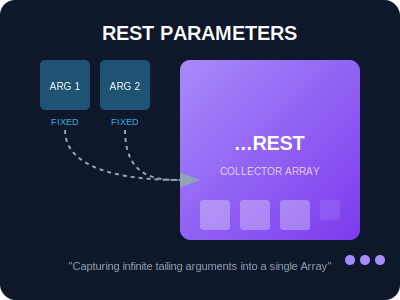
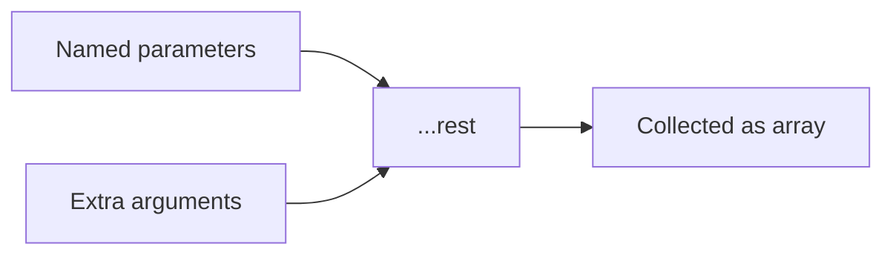

# SEC-02: Rest Parameters (The Collector Bins)

> **"Terkadang, jumlah bahan bakar yang masuk tidak menentu. Rest Parameters adalah 'Wadah Penampung' (Collector Bins) yang menangkap seluruh sisa argumen tak terbatas ke dalam satu Array tunggal yang rapi."**

## Source Hub
- **Primary Source**: [MDN Web Docs - Rest parameters](https://developer.mozilla.org/en-US/docs/Web/JavaScript/Reference/Functions/rest_parameters)
- **Technical Reference**: [ECMA-262 - Function Definitions](https://tc39.es/ecma262/#sec-function-definitions)

Sintaksis Rest parameter (`...`) memungkinkan kita merepresentasikan sejumlah argumen yang tidak terbatas sebagai sebuah array.

---

## 1. Mental Model: "The Collector Bins"

Bayangkan sebuah lini produksi. Anda memiliki slot untuk **Bahan Utama**, lalu di belakangnya ada keranjang raksasa berlabel **Lain-lain**. Berapa pun jumlah barang tambahan yang dilemparkan ke lini produksi, semuanya akan ditampung dengan rapi di dalam keranjang tersebut sebagai satu paket kesatuan.





---

## 2. Rest Parameter vs. Arguments Object

Sebelum ES6, kita menggunakan objek `arguments`. Namun, Rest parameter jauh lebih unggul karena:
- **Array Asli**: Rest parameter adalah instance `Array`, memiliki akses ke `map`, `filter`, dan `reduce` tanpa konversi manual.
- **Eksplisit**: Nama parameter (`...nums`) memberi tahu pengembang lain bahwa fungsi ini menerima banyak input.
- **Selektif**: Kita bisa menangkap argumen pertama secara terpisah dan membiarkan sisanya masuk ke Rest.

```javascript
// Mengambil argumen pertama, sisanya masuk ke 'others'
function process(first, ...others) {
    console.log(`Paling Penting: ${first}`);
    console.log(`Sisanya: ${others.length} item`);
}
```

---

## 3. Rest dan Pengolahan Lanjutan

Rest parameter juga enak dipadukan dengan pola JavaScript modern lain, termasuk destructuring, forwarding, dan wrapper functions.

```javascript
const [head, ...tail] = [1, 2, 3, 4, 5];
// head = 1, tail = [2, 3, 4, 5]
```

---

## Arsitek Mindset: Fleksibilitas Tanpa Batas

Sebagai arsitek Hub:
- **The Last One**: Ingat aturan emas: Rest parameter **WAJIB** menjadi parameter terakhir. `function f(...a, b)` akan menyebabkan `SyntaxError`.
- **Identity Forwarding**: Gunakan Rest untuk membangun *wrapper* atau *middleware* yang meneruskan argumen ke fungsi lain secara transparan.
- **Clean API**: Hindari menggunakan Rest jika jumlah argumen Anda sudah pasti. Gunakan hanya jika input bersifat variadik (berubah-ubah).

---

## Hands-on: Lab Penampung Energi
Eksperimen dengan implementasi praktis Rest parameters pada sistem logistik data di `examples/rest_params_lab.js`.

---
*Status: [status.md](../../../status.md)*
