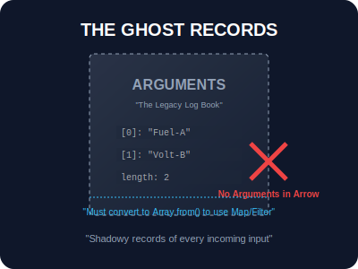

# SEC-03: The `arguments` Object (The Ghost Records)

> **"Sebelum ada sistem penampung modern (Rest), Hub menggunakan 'Buku Log Bahan Bakar' (arguments Object). Ini adalah catatan otomatis yang mencatat semua yang masuk, tapi bentuknya kaku dan tidak mudah dikelola seperti Array modern."**

Objek `arguments` adalah objek mirip array (*array-like*) yang tersedia secara lokal di dalam fungsi non-arrow.

---

## 1. Mental Model: "The Ghost Records"

Bayangkan sebuah mesin tua. Ia tidak memiliki keranjang khusus untuk menampung barang sisa. Namun, ia memiliki buku log "hantu" yang secara otomatis mencatat setiap barang yang dilemparkan ke dalam mesin oleh operator. Anda bisa membaca catatan ini, tapi karena ini bukan keranjang (Array) asli, Anda tidak bisa memindah-mindahkan isinya dengan mudah tanpa menyalinnya ke wadah baru.



---

## 2. Karakteristik & Limitasi

- **Otomatis**: Selalu tersedia dalam fungsi tradisional (deklarasi/ekspresi).
- **Array-like**: Memiliki `.length` dan index `[0]`, tapi **TIDAK** memiliki metode Array seperti `.map()`, `.filter()`, atau `.forEach()`.
- **Indeks Dinamis**: Mencerminkan semua argumen yang dikirimkan, terlepas dari berapa banyak parameter yang didefinisikan.

```javascript
function demo() {
    console.log(arguments.length); // Menghitung semua input
}
```

---

## 3. Arrow Function Trap

**PENTING**: Arrow functions **tidak memiliki** objek `arguments` sendiri. Jika Anda mengakses `arguments` di dalam arrow function, ia akan mengambil dari scope induknya (jika ada), yang seringkali menyebabkan bug yang sulit dilacak.

---

## Arsitek Mindset: Pensiunkan Buku Log Kuno

Sebagai arsitek Hub:
- **Prioritaskan Rest**: Gunakan `...args` (Rest Parameters) untuk semua fungsi baru. Rest adalah Array asli dan bekerja di semua jenis fungsi (termasuk Arrow Functions).
- **Konversi Manual**: Jika Anda TERPAKSA bekerja dengan `arguments`, segera konversikan ke Array asli menggunakan `Array.from(arguments)` atau `[...arguments]` sebelum memproses datanya.
- **Legacy Only**: Anggap objek `arguments` sebagai peninggalan sejarah yang hanya dipelajari agar Anda bisa membaca kode lama.

---

## Hands-on: Lab Buku Log Kuno
Buka file `examples/legacy_log_lab.js` untuk melihat bagaimana kita berinteraksi dengan buku log kuno dan cara memodernisasinya.

---
*Status: [status.md](../../../status.md)*
