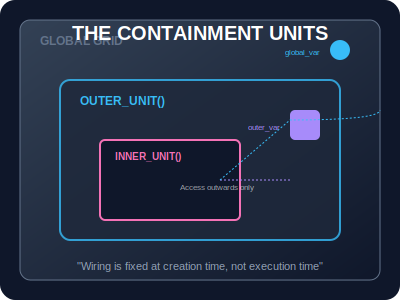
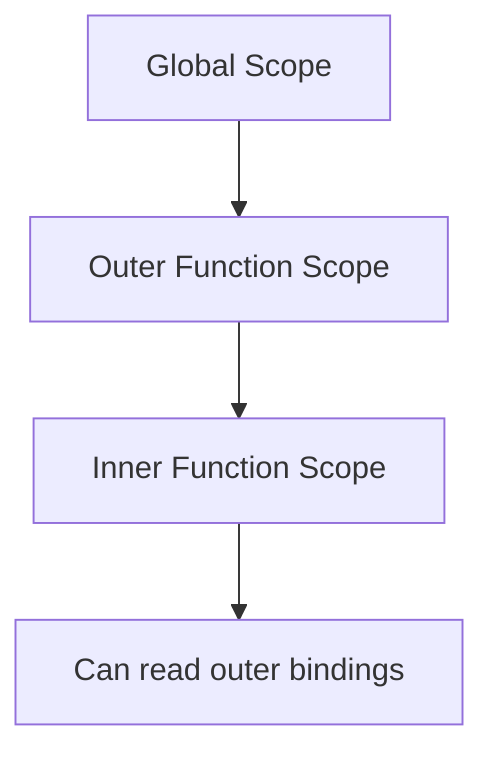

# SEC-01: Lexical Scoping (The Containment Units)

> **"Di dalam Hub Energi, setiap unit pemrosesan memiliki 'Kabel Internal' (Internal Wiring). Aliran energi hanya bisa mengalir dari unit pusat ke unit cabang, bukan sebaliknya. Lexical Scoping adalah aturan yang menentukan jalur kabel tersebut berdasarkan tempat unit dipasang."**

## Source Hub
- **Primary Source**: [MDN Web Docs - Closures](https://developer.mozilla.org/en-US/docs/Web/JavaScript/Guide/Closures)
- **Technical Reference**: [ECMA-262 - Function Definitions](https://tc39.es/ecma262/#sec-function-definitions)

Lexical Scoping (juga dikenal sebagai Static Scoping) menentukan jangkauan (*scope*) variabel berdasarkan lokasi penulisan fungsi dan variabel di dalam kode, bukan berdasarkan tempat fungsi itu dipanggil.

---

## 1. Mental Model: "The Containment Units"

Bayangkan sebuah struktur kotak di dalam kotak. 
- **Global Grid** adalah kotak terluar.
- **Outer Unit** adalah kotak di dalamnya.
- **Inner Unit** adalah kotak yang paling dalam.

Unit yang berada di dalam memiliki pandangan tembus pandang ke arah luar (bisa mengakses variabel di kotak induk). Namun, unit di luar tidak bisa melihat ke dalam kotak yang lebih kecil di bawahnya.





---

## 2. Hirarki Rantai Lingkup (Scope Chain)

Saat JavaScript mencoba mengakses sebuah variabel, ia akan melakukan pencarian berantai:
1. Cari di lingkup **Lokal** saat ini.
2. Jika tidak ada, naik ke lingkup **Induk** (Parent).
3. Terus naik hingga mencapai lingkup **Global**.
4. Jika tetap tidak ditemukan, sistem akan melempar `ReferenceError`.

---

## 3. Sifat Statis Saat Fungsi Dipanggil

Keputusan "siapa bisa mengakses apa" ditentukan dari posisi deklarasi fungsi. Jadi, ketika sebuah fungsi dipindahkan, dikirim sebagai callback, atau dipanggil dari tempat lain, jalur akses variabelnya tetap mengikuti tempat ia didefinisikan.

```javascript
const name = "Global-01";

function checkName() {
    console.log(name); // Akan selalu mencari 'name' di tempat ia dilahirkan (Global)
}
```

---

## Arsitek Mindset: Desain Modular & Enkapsulasi

Sebagai arsitek Hub:
- **Penyembunyian Informasi**: Manfaatkan scoping untuk menyembunyikan variabel sensitif di dalam fungsi agar tidak bisa dimanipulasi dari luar.
- **Shadowing**: Hati-hati dengan *Variable Shadowing*, di mana variabel lokal dengan nama yang sama "menutupi" variabel global.
- **Prediktabilitas**: Karena bersifat statis, Lexical Scoping membuat alur data dalam aplikasi Anda menjadi prediktabel dan mudah dilacak.

---

## Hands-on: Lab Jalur Kabel
Eksperimen dengan visualisasi rantai lingkup dan efek shadowing di `examples/lexical_wiring_lab.js`.

---
*Status: [status.md](../../../status.md)*
