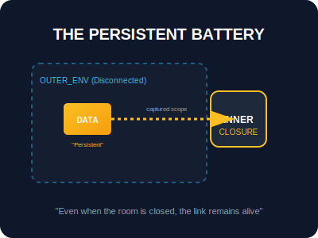

# SEC-02: Closures (The Persistent Battery)

> **"Closures adalah 'Baterai Memori' yang memungkinkan fungsi membawa data dari masa lalu ke masa depan. Meskipun ruangan (scope) asalnya sudah ditutup, fungsi ini tetap membawa 'Kabel Energi' ke tangki data yang ia tangkap."**

**Closure** adalah kombinasi dari sebuah fungsi yang dibundel bersama dengan referensi ke lingkungan sekitarnya (lingkup leksikal). Secara sederhana, closure memberi fungsi akses ke lingkup luar bahkan setelah fungsi luar tersebut selesai dieksekusi.

---

## 1. Mental Model: "The Persistent Battery"

Bayangkan sebuah fungsi luar sebagai "Ruangan" yang memiliki "Baterai" (Variabel). Saat fungsi luar selesai bekerja, ruangannya "dihancurkan" dari memori utama. Namun, fungsi dalam (*inner function*) tetap memegang "Kabel" ke baterai tersebut. Ke mana pun fungsi dalam pergi, ia tetap bisa menarik energi dari baterai yang ia bawa.



---

## 2. Kegunaan Utama: Privatisasi Data

Closures paling sering digunakan untuk mensimulasikan **Private Variables**. Karena variabel di dalam closure tidak bisa diakses langsung dari luar, ia menjadi "brankas" data yang aman.

```javascript
function createVault() {
    let secret = "12345"; // Tidak bisa diakses dari luar
    return {
        getSecret: () => secret,
        setSecret: (val) => { secret = val; }
    };
}
```

---

## 3. Aplikasi Lanjutan: Function Currying

**Currying** adalah teknik mentransformasi fungsi dengan banyak argumen menjadi serangkaian fungsi yang masing-masing menerima satu argumen. Ini dimungkinkan berkat closure yang "mengingat" argumen sebelumnya.

```javascript
const multiply = (a) => (b) => a * b;
const double = multiply(2); // '2' disimpan dalam closure
console.log(double(5)); // 10
```

---

## Arsitek Mindset: Memori & Ketahanan

Sebagai arsitek Hub:
- **Enkapsulasi**: Gunakan closure untuk melindungi status internal modul Anda dari manipulasi global.
- **Waspada Memori**: Setiap closure akan menahan referensi ke lingkup induknya, yang berarti memori tidak akan dilepaskan (GC) selama fungsi closure masih hidup. Jangan membuat closure berlebihan jika tidak perlu.
- **Factory Pattern**: Gunakan closure untuk memproduksi fungsi-fungsi khusus dari satu templat umum (seperti membuat berbagai jenis Logger).

---

## Hands-on: Lab Baterai Memori
Pelajari teknik enkapsulasi dan currying pada sirkuit fungsional di:
- `examples/currying_lab.js`
- `examples/closure_battery_lab.js`

---
*Status: [status.md](../../../status.md)*
