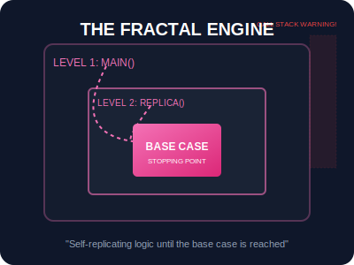

# SEC-03: Recursion (The Fractal Engine)

> **"Beberapa masalah besar di Hub harus diselesaikan dengan memecahnya menjadi replika masalah yang lebih kecil. Rekursi adalah 'Mesin Fraktal' (Fractal Engine) di mana sebuah unit memanggil salinan dirinya sendiri untuk menyelesaikan tugas secara bertingkat."**

Rekursi adalah teknik di mana sebuah fungsi memanggil dirinya sendiri untuk menyelesaikan masalah dengan memecahnya menjadi sub-masalah yang lebih kecil dari jenis yang sama.

---

## 1. Mental Model: "The Fractal Engine"

Bayangkan sebuah struktur fraktal di mana setiap cabang adalah replika kecil dari batang utama. 
- **Level 1**: Masalah utama yang harus diselesaikan.
- **Level 2 & Seterusnya**: Replika fungsi yang bekerja pada bagian data yang lebih kecil.
- **Base Case**: Titik pusat di mana replikasi berhenti dan hasil mulai dikirimkan kembali ke atas.

Tanpa **Base Case**, mesin akan terus bereplikasi tanpa henti hingga sistem kehabisan memori.



---

## 2. Anatomi Rekursi yang Aman

Setiap fungsi rekursif yang baik harus memiliki dua komponen kritikal:
1.  **Base Case**: Kondisi berhenti yang mengakhiri rekursi.
2.  **Recursive Step**: Bagian di mana fungsi memanggil dirinya sendiri dengan input yang "lebih sederhana" (mendekati base case).

```javascript
function factorial(n) {
    if (n <= 1) return 1; // BASE CASE
    return n * factorial(n - 1); // RECURSIVE STEP
}
```

---

## 3. Limitasi: Call Stack & Stack Overflow

Setiap kali fungsi memanggil dirinya sendiri, sebuah lapisan baru ditambahkan ke **Call Stack**. Jika rekursi terlalu dalam (misal: memanggil diri sendiri 1 juta kali), sistem akan kehabisan ruang dan menyebabkan error `Maximum call stack size exceeded`.

---

## Arsitek Mindset: Elegan vs Efisien

Sebagai arsitek Hub:
- **Navigasi Pohon**: Gunakan rekursi saat berhadapan dengan struktur data bertingkat seperti folder file, kategori produk, atau DOM pohon.
- **Keterbacaan**: Rekursi sering kali menghasilkan kode yang jauh lebih bersih dan elegan dibandingkan perulangan `while` yang rumit.
- **Keamanan**: Selalu uji rekursi Anda dengan nilai ekstrem untuk memastikan base case selalu tercapai.

---

## Hands-on: Lab Pemecahan Berantai
Eksperimen dengan pencarian data mendalam dan perhitungan matematis bertingkat di `examples/recursion_math_lab.js`.

---
*Status: [status.md](../../../status.md)*
