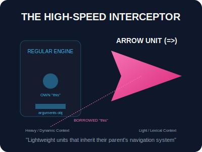

# SEC-01: Arrow Functions (The High-Speed Interceptor)

> **"Beberapa tugas di Hub hanya membutuhkan unit kecil yang cepat dan spesifik tanpa perlu seluruh ruang mesin yang besar. Arrow Functions adalah 'Unit Pencegat Cepat' (High-Speed Interceptor) yang dirancang untuk efisiensi tinggi, berpergian ringan tanpa membawa sistem navigasi sendiri."**

## Source Hub
- **Primary Source**: [MDN Web Docs - Arrow function expressions](https://developer.mozilla.org/en-US/docs/Web/JavaScript/Reference/Functions/Arrow_functions)
- **Technical Reference**: [ECMA-262 - Arrow Function Definitions](https://tc39.es/ecma262/#sec-arrow-function-definitions)

**Arrow function** menyediakan cara yang lebih ringkas untuk menulis ekspresi fungsi. Namun, perbedaannya bukan sekadar sintaksis; ia memiliki perilaku fundamental yang berbeda terkait konteks `this` dan objek `arguments`.

---

## 1. Mental Model: "The High-Speed Interceptor"

Bayangkan Arrow Function sebagai pesawat pencegat yang ringan. Pesawat ini tidak membawa sistem navigasi (*Context Unit*) sendiri. Sebagai gantinya, ia selalu menggunakan sistem navigasi dari kapal induk (lingkup induk) tempat ia diluncurkan.




---

## 2. Fitur "Lexical This"

Inilah pembeda paling penting. Di dalam fungsi tradisional, nilai `this` ditentukan oleh **bagaimana** fungsi itu dipanggil. Di dalam Arrow Function, `this` mengikuti nilai `this` dari scope tempat arrow function dibuat.

```javascript
function Hub() {
    this.energy = 100;

    // Arrow function 'meminjam' this dari Hub()
    setInterval(() => {
        this.energy++; // Bekerja sesuai harapan!
    }, 1000);
}
```

---

## 3. Sintaksis & Implicit Return

Arrow functions memungkinkan penulisan satu baris yang sangat bersih dengan **Implicit Return** (mengembalikan nilai tanpa kata kunci `return`).

```javascript
// Satu parameter, satu ekspresi: Super Ringkas
const square = x => x * x; 

// Tanpa parameter, butuh kurung kosong
const notify = () => console.log("Alert!");
```

---

## Arsitek Mindset: Kapan Harus Menghindar?

Sebagai arsitek Hub:
- **Metode Objek**: Jangan gunakan Arrow Function sebagai metode objek jika Anda ingin mengakses properti objek tersebut via `this`.
- **Konstruktor**: Arrow Functions tidak bisa digunakan dengan kata kunci `new`. Mereka bukan konstruktor.
- **Generator**: Arrow Functions tidak bisa menjadi Generator (tidak bisa menggunakan `yield`).
- **Standardisasi**: Gunakan Arrow Functions untuk callback (Array methods), transformasi data singkat, dan fungsi utilitas kecil yang tidak butuh `this` sendiri.

---

## Hands-on: Lab Unit Pencegat
Eksperimen dengan perbandingan perilaku `this` dan efisiensi sintaksis di `examples/arrow_unit_lab.js`.

---
*Status: [status.md](../../../status.md)*
