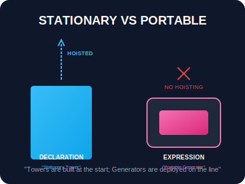
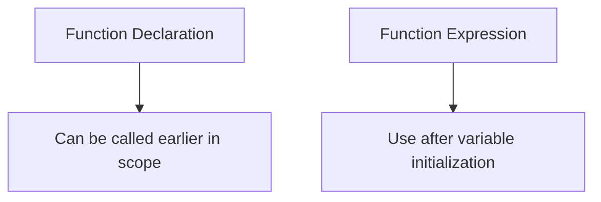

# SEC-02: Expressions vs Declarations (Stationary vs Portable)

> **"Di dalam Hub, ada unit yang dibangun permanen sebagai bagian dari struktur dasar (Declarations) dan ada unit yang bisa dipindah-pindahkan atau disimpan dalam kontainer (Expressions). Mengetahui kapan menggunakan masing-masing adalah kunci fleksibilitas Hub."**

## Source Hub
- **Primary Source**: [MDN Web Docs - Functions](https://developer.mozilla.org/en-US/docs/Web/JavaScript/Guide/Functions)
- **Technical Reference**: [ECMA-262 - Function Definitions](https://tc39.es/ecma262/#sec-function-definitions)

JavaScript memungkinkan kita mendefinisikan fungsi melalui pernyataan (Declaration) atau ekspresi (Expression). Perbedaan utamanya terletak pada **kapan** fungsi tersebut tersedia untuk digunakan.

---

## 1. Mental Model: "Stationary vs Portable Units"

- **Function Declaration (Stationary)**: Seperti menara pemancar permanen yang dibangun paling awal. Karena mekanisme **Hoisting**, menara ini sudah terdaftar dan siap digunakan di seluruh Hub bahkan sebelum blueprint-nya dibaca lengkap dari atas ke bawah.
- **Function Expression (Portable)**: Seperti generator portabel yang disimpan di dalam kontainer (variabel). Anda tidak bisa menyalakannya sebelum variabel tersebut benar-benar diinisialisasi pada baris kodenya.





---

## 2. Hoisting: "The Uplift Mechanism"

Deklarasi fungsi tersedia lebih awal di dalam scope yang sama. Ekspresi fungsi mengikuti aturan variabel tempat ia disimpan, sehingga Anda biasanya baru aman memakainya setelah baris inisialisasinya lewat.

```javascript
/* STATIONARY: Aman dipanggil di mana saja */
towerStatus(); 

function towerStatus() { console.log("Tower is ONLINE"); }

/* PORTABLE: Harus diinisialisasi dulu */
// generatorRun(); // ERROR!

const generatorRun = function() { console.log("Generator is RUNNING"); };
```

---

## 3. Named vs Anonymous Expressions

Ekspresi fungsi seringkali tidak bernama (anonymous). Namun, memberikan nama internal pada ekspresi dapat sangat membantu saat prosedur perbaikan (*debugging*), karena nama tersebut akan muncul di dalam *Stack Trace* sistem.

```javascript
const compute = function calculatePower(v, i) {
    return v * i;
};
```

---

## Arsitek Mindset: Ketertiban Blueprint

Sebagai arsitek Hub:
- **Declarations**: Gunakan untuk fungsi-fungsi utama yang memang ingin dibaca sebagai fondasi alur atau helper penting dalam satu scope.
- **Expressions**: Gunakan untuk fungsi yang dikirim sebagai argumen (*callbacks*), fungsi yang bersifat lokal/sementara, atau saat Anda ingin memastikan fungsi tidak bisa dipanggil sebelum didefinisikan secara eksplisit.
- **Consistency**: Meskipun declaration bisa dipanggil lebih awal, tetaplah menulis fungsi dekat dengan area penggunaannya agar blueprint kode tetap mudah diikuti.

---

## Hands-on: Lab Stasiun Kerja
Buka file `examples/fn_compare_lab.js` untuk melihat eksperimen perbandingan antara menara permanen dan generator portabel.

---
*Status: [status.md](../../../status.md)*
