# SEC-03: IIFE (The Quick Burst Units)

> **"Terkadang, Anda memerlukan ledakan energi sekali saja untuk inisialisasi awal tanpa ingin sisa residunya mengotori grid global. IIFE adalah 'Unit Ledakan Singkat' (Quick Burst) yang menyala, bekerja, dan langsung padam seketika."**

**Immediately Invoked Function Expression (IIFE)** adalah fungsi yang segera dieksekusi tepat setelah ia didefinisikan. 

---

## 1. Mental Model: "The Quick Burst"

Bayangkan Hub memiliki tombol "Reset Global". Anda ingin tombol ini menyalakan sirkuit pembersihan, menyapu semua debu di memori, lalu sirkuit tersebut menghancurkan dirinya sendiri agar tidak mengonsumsi daya atau meninggalkan jejak. IIFE dibungkus dalam "Kurung Pelindung" `()` untuk mengubahnya menjadi ekspresi, dan langsung dipicu dengan "Tombol Eksekusi" `()`.



---

## 2. Struktur & Variasi

Sintaksis standar IIFE membungkus fungsi anonim dalam tanda kurung untuk memberitahu mesin JavaScript bahwa ini adalah ekspresi, bukan deklarasi.

```javascript
// Pola Klasik
(function() {
    console.log("Sirkuit terisolasi.");
})();

// Pola dengan Parameter (Passing Dependencies)
(function(hubID, version) {
    console.log(`Menginisialisasi ${hubID} v${version}`);
})("NEXUS-Alpha", "2.0");
```

---

## 3. Kegunaan: Isolasi & Privasi

Alasan utama penggunaan IIFE adalah **Enkapsulasi**. Karena variabel di dalam IIFE bersifat lokal pada lingkup fungsi tersebut, mereka tidak akan mencemari lingkup global. Ini sangat penting sebelum adanya ES6 Modules untuk mencegah konflik nama variabel antar pustaka (*library*).

```javascript
const result = (function() {
    const internalSecret = "0xABC123";
    return internalSecret.toLowerCase(); // Hanya mengekspos hasil, bukan prosesnya
})();
```

---

## Arsitek Mindset: Bersihkan Jalur Grid

Sebagai arsitek Hub:
- **Tugas Sekali Jalan**: Gunakan IIFE untuk tugas inisialisasi yang hanya perlu dijalankan satu kali saat Hub dinyalakan.
- **Isolasi Script**: Jika Anda menulis script yang akan disisipkan ke sistem besar tanpa module loader, IIFE adalah "pelapis pelindung" wajib agar kode Anda tidak merusak sirkuit global.
- **Titik Koma (Semicolon)**: Selalu awali blok IIFE Anda dengan `;` (misal: `;(function(){...})()`) untuk menghindari error saat penggabungan file (*bundling*).

---

## Hands-on: Lab Ledakan Inisialisasi
Pelajari teknik isolasi dan pengembalian nilai dari unit ledakan singkat di `examples/iife_burst_lab.js`.

---
*Status: [status.md](../../../status.md)*
