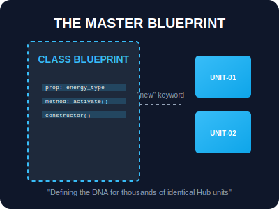

# SEC-01: Class Declarations (The Master Blueprint)

> **"Membangun satu unit energi secara manual mungkin mudah. Namun, untuk membangun ribuan unit yang identik, Anda membutuhkan 'Cetak Biru Utama' (Master Blueprint). Class Declarations adalah standar industri yang merangkum seluruh spesifikasi unit dalam satu dokumen tunggal."**

Class di JavaScript bukanlah tipe data baru, melainkan "Gula Sintaksis" (*Syntactic Sugar*) di atas sistem prototipe yang sudah ada. Class menyediakan cara yang lebih bersih, elegan, dan terstruktur untuk membuat objek serta menangani warisan (*inheritance*).

## Source Hub
- [MDN Web Docs - Classes](https://developer.mozilla.org/en-US/docs/Web/JavaScript/Reference/Classes)
- [MDN Web Docs - class declaration](https://developer.mozilla.org/en-US/docs/Web/JavaScript/Reference/Statements/class)

---

## 1. Mental Model: "The Master Blueprint"

Bayangkan Anda adalah arsitek Hub. Alih-alih menggambar setiap generator satu per satu, Anda membuat satu blueprint pusat bertajuk `class Generator`. Blueprint ini mendefinisikan "DNA" dari setiap unit:
- **Properties**: Apa saja bagian-bagiannya (misal: `energyLevel`).
- **Methods**: Apa saja yang bisa dilakukannya (misal: `charge()`).
- **Constructor**: Bagaimana cara merakitnya saat pertama kali dipesan.



```mermaid
flowchart LR
    A[class EnergyUnit] --> B[new EnergyUnit()]
    B --> C[instance unit01]
    A --> D[shared methods]
    C --> E[own data via this]
```

---

## 2. Sintaksis & Instansiasi

Mendefinisikan class menggunakan kata kunci `class`, dan membuat objek nyata dari blueprint tersebut menggunakan kata kunci `new`.

```javascript
class EnergyUnit {
    // Definisi rincian unit di sini
}

// Proses 'Factory': Membuat unit fisik (Instance)
const unit01 = new EnergyUnit();
```

---

## 3. Aturan Main Arsitektur

Berbeda dengan fungsi biasa, Class memiliki beberapa batasan demi keamanan sistem:
- **No Hoisting**: Anda tidak bisa memanggil class sebelum ia didefinisikan (tidak ada pengangkatan blueprint otomatis).
- **Strict Mode**: Semua kode di dalam class berjalan secara otomatis dalam *Strict Mode*.
- **Constructor Requirement**: Class dirancang untuk dipanggil dengan `new`. Jika Anda memanggilnya seperti fungsi biasa, sistem akan melempar error.

---

## Arsitek Mindset: Standarisasi Unit

Sebagai arsitek Hub:
- **PascalCase**: Selalu gunakan PascalCase untuk nama class (misal: `ThermalReactor`) untuk menandai bahwa ini adalah blueprint, bukan fungsi biasa.
- **Enkapsulasi**: Gunakan class untuk menyatukan data dan logika yang berkaitan erat ke dalam satu unit modular.
- **Modernitas**: Tinggalkan pola `function Constructor` lama. Gunakan `class` sebagai standar emas untuk pembangunan infrastruktur Hub masa depan.

---

## Hands-on: Lab Cetak Biru Utama
Mulai merakit unit energi pertama Anda menggunakan cetak biru modern di `examples/class_basics_lab.js`.

---
*Status: [status.md](../../../status.md)*
