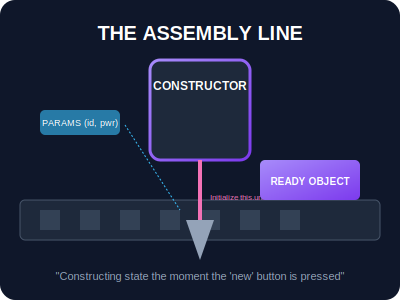

# SEC-02: Constructors (The Assembly Line)

> **"Blueprint saja tidak cukup; Anda harus tahu bagaimana cara merakit unit tersebut saat pertama kali keluar dari gudang. Constructor adalah 'Lini Perakitan' (Assembly Line) yang secara otomatis berjalan untuk memberikan identitas dan energi awal pada unit baru."**

Metode `constructor` adalah metode khusus yang digunakan untuk menciptakan dan menginisialisasi objek yang dibuat dengan sebuah class. Metode ini dipanggil secara otomatis saat kata kunci `new` digunakan.

## Source Hub
- [MDN Web Docs - constructor](https://developer.mozilla.org/en-US/docs/Web/JavaScript/Reference/Classes/constructor)
- [MDN Web Docs - Classes](https://developer.mozilla.org/en-US/docs/Web/JavaScript/Reference/Classes)

---

## 1. Mental Model: "The Assembly Line"

Bayangkan sebuah robot di pabrik. Begitu blueprint dipilih dan tombol `new` ditekan, robot perakit (**Constructor**) langsung bekerja menyuntikkan data awal:
- **Identity Injection**: Memberikan nama unik (`this.id`).
- **Energy Setup**: Mengatur kapasitas daya awal (`this.capacity`).
- **Initial Verification**: Memastikan semua komponen dalam kondisi prima sebelum unit dikirim ke Grid.



```mermaid
flowchart LR
    A[new Transformer(id, capacity)] --> B[constructor runs]
    B --> C[this.id = id]
    B --> D[this.capacity = capacity]
    B --> E[this.isOperational = false]
    E --> F[ready instance]
```

---

## 2. Cara Kerja `this` dalam Perakitan

Di dalam constructor, kata kunci `this` merujuk pada **instansi baru** (objek yang sedang dikonstruksi). Kita menggunakan `this` untuk menempelkan properti pada unit tersebut.

```javascript
class Transformer {
    constructor(id, capacity) {
        this.id = id;
        this.capacity = capacity;
        this.isOperational = false; // Status default
    }
}
```

---

## 3. Aturan Emas Arsitektur

- **Single Assembly**: Sebuah class hanya boleh memiliki **satu** metode constructor. Memiliki dua constructor akan menyebabkan `SyntaxError`.
- **Auto-Injection**: Jika Anda tidak menulis constructor sendiri, JavaScript akan menyisipkan constructor kosong secara otomatis.
- **Immediate Execution**: Instruksi di dalam constructor dijalankan tepat di awal siklus hidup objek, menjadikannya tempat terbaik untuk validasi input.

---

## Arsitek Mindset: Integritas Rakitan

Sebagai arsitek Hub:
- **Input Validation**: Gunakan constructor untuk memblokir perakitan unit yang cacat (misal: kapasitas negatif atau ID yang tidak valid).
- **Lightweight Process**: Jangan meletakkan logika komputasi yang berat di sini. Constructor hanya untuk persiapan; biarkan metode lain yang menangani operasional berat.
- **Default Value**: Berikan nilai awal yang aman agar unit tetap bisa berfungsi meskipun tidak semua parameter dikirimkan oleh operator.

---

## Hands-on: Lab Lini Perakitan
Simulasikan perakitan modul energi dengan validasi cerdas di `examples/assembly_line_lab.js`.

---
*Status: [status.md](../../../status.md)*
