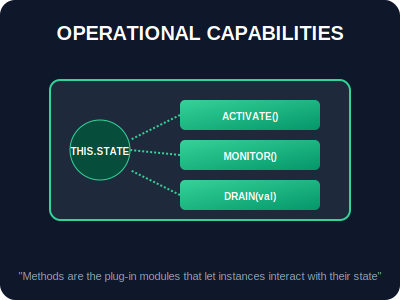
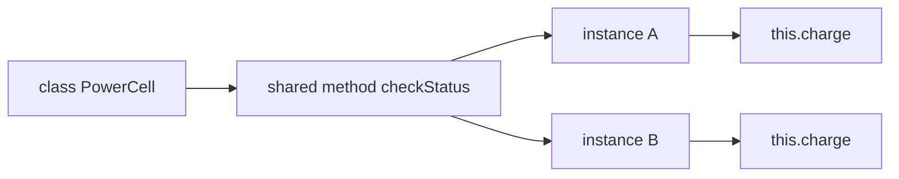

# SEC-03: Methods (Operational Capabilities)

> **"Sebuah unit energi tidak hanya memiliki komponen, ia harus bisa bertindak. Methods adalah 'Modul Kemampuan' (Operational Modules) yang menentukan apa saja yang bisa dilakukan oleh unit tersebut di dalam Grid."**

Metode adalah fungsi yang didefinisikan di dalam class untuk menentukan perilaku dari instansi class tersebut. Metode memungkinkan objek untuk berinteraksi dengan data internalnya sendiri dan melakukan tugas-tugas spesifik.

## Source Hub
- [MDN Web Docs - Classes](https://developer.mozilla.org/en-US/docs/Web/JavaScript/Reference/Classes)
- [MDN Web Docs - Method definitions](https://developer.mozilla.org/en-US/docs/Web/JavaScript/Reference/Functions/Method_definitions)

---

## 1. Mental Model: "Operational Modules"

Bayangkan unit generator Anda memiliki slot-slot khusus untuk "Modul Kemampuan":
- **Module `activate()`**: Mengubah status dari OFFLINE ke ONLINE.
- **Module `monitor()`**: Membaca sensor daya saat ini.
- **Module `surge(val)`**: Memberikan lonjakan energi sesuai kebutuhan.

Setiap unit yang dibuat dari blueprint yang sama akan memiliki modul kemampuan yang identik, namun setiap modul akan bekerja pada data (`this.state`) milik unit itu sendiri.





---

## 2. Definisi & Konteks `this`

Dalam class, kita mendefinisikan metode tanpa kata kunci `function`. Di dalam metode, kita menggunakan `this` untuk mengakses properti atau metode lain dari instansi yang sama.

```javascript
class PowerCell {
    constructor(charge = 100) {
        this.charge = charge;
    }

    // Definisi metode
    checkStatus() {
        return `Charge level: ${this.charge}%`;
    }
}
```

---

## 3. Efisiensi: Berbagi Perilaku

Dalam praktik sehari-hari, hal pentingnya adalah ini: unit-unit yang dibuat dari class yang sama bisa berbagi definisi perilaku yang sama tanpa Anda perlu menyalin ulang fungsi ke setiap objek. Hasilnya, class terasa rapi dipakai dan tetap efisien saat jumlah instansi bertambah.

---

## Arsitek Mindset: Batas Kemampuan

Sebagai arsitek Hub:
- **Single Responsibility**: Pastikan setiap metode memiliki tugas yang spesifik dan terbatas.
- **Method Chaining**: Pertimbangkan untuk mengembalikan `this` di akhir metode mutasi agar Anda bisa memanggil metode secara berantai (misal: `unit.start().charge().log()`).
- **Standardisasi**: Gunakan nama metode yang deskriptif dan konsisten di seluruh Hub agar operator lain mudah memahami cara mengendalikan unit Anda.

---

## Hands-on: Lab Modul Kemampuan
Eksperimen dengan interaksi antar modul dan mutasi status unit di `examples/unit_capabilities_lab.js`.

---
*Status: [status.md](../../../status.md)*
